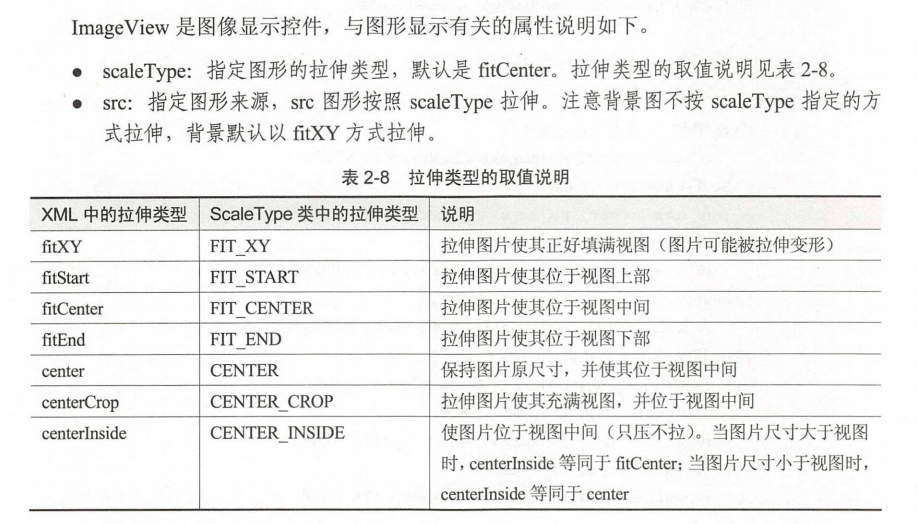

##### Anroid 项目依赖

[Android 项目的依赖方式](https://blog.csdn.net/Wbl752134268/article/details/134805297)
[gradle迁移到gradle.kts(复制可用)](https://blog.csdn.net/github_34790294/article/details/122506907)
##### application settings

在application节点中设置应用主题为无标题样式

修改位置：AndroidMainfest.xml 中的application节点

```xml
android:theme="@style/Theme.AppCompat.Light.NoActionBar"
android:theme=”@android:style/Theme.Black.NoTitleBar”
android:theme=”@android:style/Theme.Light.NoTitleBar”
android:theme=”@android:style/Theme.NoTitleBar”
```

```java
Handler handler = new Handler(Looper.getMainLooper());
```

```java
Toast.makeText(this, "",Toast.LENGTH_SHORT).show();
```

##### 大小单位

dp 与物理设备无关，只与屏幕的尺寸有关。

sp 的原理跟 dp 差不多，专门用于设置字体大小。手机在系统设置里可以调整字体的大小

（小、普通、大、超大）。设置普通字体时，同数值 dp sp 的文字看起来 样大；如果设置

为大字体，用 dp 设置的文字没有变化，用 sp 设置的文字就变大了。

##### 颜色

八位编码 FFEEDDCC, FF 表示透明度， EE 表示红色的浓度， DD 表示绿色的浓度， cc 表示蓝色的浓度。

在布局文件中设置颜色需要在色值前面加"#"，如 ```android:textColor= '#00000'```。在代码中设置颜色可以直接填八位的十六进制数值，如 ```setTextColor(Oxff00ff00)```。

res/values 录下有个 colors.xml 文件，是颜色常量的定义文件。代码中 ```getResources.getColor(R.color.color_name)```。
#### Inflate
```java
public View inflate(@LayoutRes int resource, @Nullable ViewGroup root, boolean attachToRoot)
```
根据 `resource` 和 `root` 提供的父布局的 `layout` 属性创建一个 `View`，`attachToRoot` 决定了是否将新创建的 `View` 加入到父控件中去。
[Android学习之inflate方法的了解](https://blog.csdn.net/weixin_43784358/article/details/109536623) 

代码中获取正确颜色：
```java
setBackgroundColor(ContextCompat.getColor(context, R.color.white));
```
#### Widget

##### View

xml属性

```
id;layout_width=30dp,wrap_content,match_content;layout_height;
layout_marginTop=10dp;layout_marginBottom;layout_marginLeft;layout_marginRight;
minWidth=30dp;minHeight;
background=img,color;
layout_gravity=left,right,top,bottom,center,center_horizontal,center_vertical;
padding=5dp;paddingLeft;paddingRight;paddingTop;paddingBottom;
visibility=visible,invisible,gone;
```

java代码

```
setLayoutParams(new ViewGroup.LayoutParams(ViewGroup.LayoutParams.MATCH_PARENT;...,ViewGroup.LayoutParams.MATCH_PARENT;...));
setMinimumWidth("30dp");setMinimumHeight("30dp");
setBackgroundColor(color);
setBackgroundDrawable(img_drawable);//设置背景图片
setBackgroundResource(img_id);
setPadding(0, 0, 0, 0);
setVisibility(View.VISIBLE;View.INVISIBLE;View.GONE);
```

##### Linearlayout:ViewGroup

xml属性

```
orientation=horizontal,vertical;
gravity=center,...;
```

java代码

```
setOrientaion("horizontal");
setGravity("center";...);
```

#### ConstraintLayout
[万字长文 - 史上最全ConstraintLayout（约束布局）使用详解](https://blog.csdn.net/Android_boom/article/details/115740421)
```xml
<!-- 基本方向约束 -->
<!-- 我的什么位置在谁的什么位置 -->
app:layout_constraintTop_toTopOf=""           我的顶部和谁的顶部对齐
app:layout_constraintBottom_toBottomOf=""     我的底部和谁的底部对齐
app:layout_constraintLeft_toLeftOf=""         我的左边和谁的左边对齐
app:layout_constraintRight_toRightOf=""       我的右边和谁的右边对齐
app:layout_constraintStart_toStartOf=""       我的开始位置和谁的开始位置对齐
app:layout_constraintEnd_toEndOf=""           我的结束位置和谁的结束位置对齐

app:layout_constraintTop_toBottomOf=""        我的顶部位置在谁的底部位置
app:layout_constraintStart_toEndOf=""         我的开始位置在谁的结束为止
<!-- ...以此类推 -->

```
##### ScrollView

（1）垂直方向滚动时， layout_width 要设 match_parent, layout_ height 要设置为 wrap_ content

（2）水平方向滚动时， layout_width 要设置为 wrap_content, layout_ height 要设置为 match _parent

（3）滚动视图节点下面必须且只能挂着一个子布局节点，否 会在运行时报 Caused by: java.lang.IllegalStateException: Scroll View can host only one direct child

（4）xml 属性 fillViewport 设置成 true 时即便实际内容不够也能填满父节点屏幕。

##### TextView

xml属性

```
text;textColor;textSize;gravity;
textAppearance=;//风格定义在 res/styles.xml
```

##### Button

```
drawableTop;drawableBottom;drawableLeft;drawableRight;//文字旁放图形
drawablePadding;//文字与图形的间距
```

```java
drawable = getResources().getDrawable(R.mipmap.ic_launcher);
//必须设置图片大小，否则不显示图片
drawable.setBounds(0, 0, drawable.getMinimumWidth(), drawable.getMinimumHeight());
btn icon.setCompoundDrawables(drawable null, null, null);//left,top,right,bottum
```

##### ImageView



java代码

```
setScaleType();
setImageDrawable();
setImageResource();
setImageBitmap();
```

##### Drawable

```java
Drawable drawable= getResources().getDrawable(R.drawable pie);
```

##### StateListDrawable

```
<selector xmlns:android＝"http://schemas.android.com/apk/res/android"
	<item android:state_pressed="true" android:drawable="@drawable/button_pressed"/>
	<item android:drawable="@drawable/button_normal"/>
</selector>
```

```
state_pressed;state_checked;state_focused;state_selected;
```

##### Shape

[Android样式之shape标签(基础)](https://blog.csdn.net/gqg_guan/article/details/135092502)

**Adaptor**

```java
public class FruitAdapter extends BaseAdapter {
    public static class Fruit{
        public int icon;
        public String name;
        public Fruit(int icon, String name){
            this.icon = icon;
            this.name = name;
        }
    }
    private LayoutInflater inflater;
    private Context context;
    private int layout_id;
    private ArrayList<Fruit> fruits;
    private int background_color;
    public FruitAdapter(Context context, int layout_id, ArrayList<Fruit> fruits, int background_color){
        this.inflater = LayoutInflater.from(context);
        this.context = context;
        this.layout_id =layout_id;
        this.fruits = fruits;
        this.background_color = background_color;
    }
    @Override
    public int getCount() {return fruits.size();}
    @Override
    public Object getItem(int position) {return fruits.get(position);}
    @Override
    public long getItemId(int position) {return position;}
    @Override
    public View getView(int position, View convertView, ViewGroup parent) {
        ViewHolder holder = null;
        if (convertView == null){
            holder = new ViewHolder();
            convertView = inflater.inflate(layout_id, null);
            holder.ll_item = (LinearLayout)convertView.findViewById(R.id.ll_item);
            holder.iv_icon = (ImageView)convertView.findViewById(R.id.iv_icon);
            holder.tv_name = (TextView)convertView.findViewById(R.id.tv_name);
            convertView.setTag(holder);
        }
        else{
            holder = (ViewHolder) convertView.getTag();
        }
        Fruit fruit = fruits.get(position);
        holder.ll_item.setBackgroundColor(this.background_color);
        holder.iv_icon.setImageResource(fruit.icon);
        holder.tv_name.setText(fruit.name);
        return convertView;
    }
    public final class ViewHolder{
        public LinearLayout ll_item;
        public ImageView iv_icon;
        public TextView tv_name;
    }
}
```


##### Spinner

需要搭配 Adaptor 使用

java代码

```java
Spinner sp1 = (Spinner) findViewById(R.id.sp_dialog1);
        sp1.setPrompt("Choose a fruit");
        sp1.setAdapter(adapter);
        sp1.setSelection(1);
        sp1.setOnItemSelectedListener(new AdapterView.OnItemSelectedListener(){
            @Override
            public void onItemSelected(AdapterView<?> parent, View view, int position, long id) {
                Log.i("Fruit", String.format("sp1 position:%d, id:%d", position, id));
                iv_icon_show.setImageResource(ic_fruits[position]);
                tv_name_show.setText(str_fruits[position]);
            }
            @Override
            public void onNothingSelected(AdapterView<?> parent) {

            }
        });
```

##### ListView

xml

```
divider;dividerHeight;
headerDividersEnabled=true,false;footerDividerdEnabled;
```

防止项内空间抢占列表焦点

```java
android:descendantFocusability="blocksDescendants"
```

##### RecycleView

```java
scrollToPosition//滚动到指定位置。
notifyltemlnse ed//通知适配器在指定位置已插入新项
notifyltemRemoved//通知适配器在指定位置已删除原有项
notifyltemChanged//通知适配器在指定位置的项目已发生变化
notifyDataSetChanged//通知适配器整个列表的数据已发生变化
```


##### GridLayoutManager

```java
setSpanCount//设置网格的列数。
setSpanSizeLookup//设置列表项的占位规则
```

```java
//第一项和第二项平分占两列，其它项占一列
manager.setSpanSizeLookup(new GridLayoutManager.SpanSizeLookup() { 
	@Override
    public int getSpansize(int position){
        return position == 1 || position==2 ? 2 : 1;
    }
}); 
```

##### StaggeredGridLayoutManager

```java
setSpanCount//设置网格的列数。
setOrientation//设置瀑布流布局的方向。取值说明同 LinearLayoutManager
setReverseLayout//设置是否为相反方向开始布局，默认 false 。如果设置为 true ，那么垂直方向将从下往上开始布局，水平方向将从右往左开始布局。
```

#### WebView

[Android WebView 的使用(超详细用法)](https://www.cnblogs.com/linhaostudy/p/14617314.html)
```java
WebView webView = (WebView) findViewById(R.id.wv_webview);
//访问网页
webView.loadUrl("http://www.baidu.com");
//系统默认会通过手机浏览器打开网页，为了能够直接通过WebView显示网页，则必须设置
webView.setWebViewClient(new WebViewClient(){
	@Override
	public boolean shouldOverrideUrlLoading(WebView view, String url) {
		//使用WebView加载显示url                 
		view.loadUrl(url);
		return true;
	}
});
```
需要添加网络权限。
```xml
<!-- 添加网络权限 --> <uses-permission android:name="android.permission.INTERNET" />
```
#### Fragment

有了适用于动态注册的适配器与碎片对象，还需要 个主页面配合才能完成整个页面的展示，页面不能继承 Activity ，只能继承AppCompatActivity 或 FragmentActivity。

Fragment Tran

```java
private void showFragment(Fragment fragment) {  
    fragmentTransaction = fragmentManager.beginTransaction();  
    fragmentTransaction.replace(R.id.fragment_container, fragment);  
    fragmentTransaction.addToBackStack(null); // 可选：添加到返回栈，支持返回操作  
    fragmentTransaction.commit();  
}  
```

### 数据存储

##### SharedPreferences

```java
SharedPreferences sps = getSharedPreferences("share", Context.MODE_PRJVATE);//打开一个xml用来保存可持久化数据，没有则自动创建
```

保存数据需要用到 ```SharedPreferences.Editor``` 类。

```java
SharedPreferences.Editor editor= sps.edit(); 
editor.putString（"name", "Mr Lee"); 
editor.putlnt("age", 30); 
editor.putBoolean("married", true);
editor.putFloat("weight", 100f);
editor.commit();//将数据发送到 xml 去
```

取出数据。

```java
String name = sps.getString("name", "");
```

### SD 卡文件读取操作

App权限
```xml
<uses-permission android:name="android.permission.WRITE_EXTERNAL_STORAGE"/>
<uses-permission android:name="android.permission.READ_EXTERNAL_STORAGE"/>
<uses-permission android:name="android.permission.MANAGE_EXTERNAL_STORAGE"/>
```
获取目录
```java
File  
        root_dir = getRootDirectory(), //系统根目录  
        data_dir = getDataDirectory(), //系统数据目录  
        download_dir = getDownloadCacheDirectory(), //下载缓存目录  
        sd_dir = getExternalStorageDirectory(); //外部存储目录  
String sd_state = getExternalStorageState(); //SD状态  
Log.i("YES", String.format("%s\n%s\n%s\n%s\n%s\n",  
        root_dir.getPath().toString(),  
        data_dir.getPath().toString(),  
        download_dir.getPath().toString(),  
        sd_dir.getPath().toString(),  
        sd_state));
```

#### 图片存取

Android 开发中图片的基本处理用到了类 `Bitmap`。

Context 类中提供了一个openFileOutput()方法，可以用于将数据存储到指定的文件中。这个方法接受两个参数，第一个参数是文件名。在文件创建的时候使用的就是这个名称，注意这里指定的文件名不可以包含路径。因为所有的文件都是默认存储到`/data/data/<package name>/files/`目录下的。第二个参数是文件的操作模式，主要有两种模式可选`MODE_PRVATE`和`MODE_APPEND`，前者是默认的操作模式

```java
Bitmap bitmap = Bitmap.Factory.decodeResource(this.getResources(), R.drawable.img);
bitmap.compress(Bitmap.CompressFormat.PNG, 100, openFileOutput("picture", Context.MODE_PRIVATE));
Bitmap new_bitmap = BitmapFactory.decodeStream(openFileInput("picture"));
((ImageView)iv).setImageBitmap(bitmap);
```

#### JSON

##### JSON 同时打包文本、整数、图片
```java
String getJsonString(final String name, final int id, final Bitmap bitmap){
	try{
		JSONObject object = new JSONObject();
		object.put("name", name);
		object.put("id", id);
		Byte[] img_data = BitmapToByte(bitmap);
		object.put("img_str", Base64.encodeToString(img_data, 0));
		return object.toString()
	} catch(JSONException e){
		e.printStackTrace();
	}
}

DataBean getDataBeanByJsonStr(final String json_str){
	DataBean databean = new DataBean();
	try{
		JSONObject object = new JSONObject(json_str);
		databean.name = object.getString("name");
		databean.id = object.getInt("id");
		String img_str = object.getString("img_str");
		byte[] img_data = Base64.decode(img_str, 0);
		databean.bitmap = BitmapFactory.decodeByteArray(img_data, 0, img_data.length);
		return databean;
	} catch(JSONException e){
		e.printStackTrace();
	}

}

```
### Bug集合

（1）不加 false 崩溃。

```
View v = inflater.inflate(layout_id, parent);
```

```
View v = inflater.inflate(layout_id, parent, false);
```

