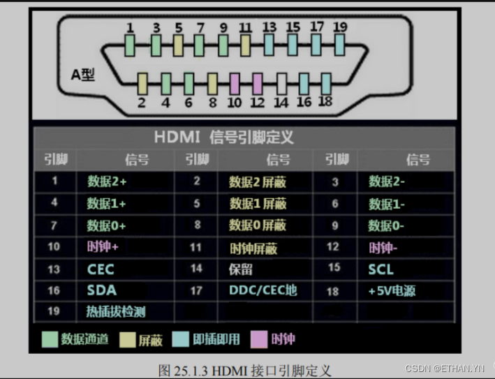

[Introduction to HDMI protocol](https://www.displaymodule.com/blogs/knowledge/introduction-to-hdmi-protocol)

[HDMI接口协议](https://blog.csdn.net/weixin_42581439/article/details/137542307)

- 1-12 pin 用于传输 TMDS（Transition Minimized Differential）数据，包括 1-9 pin 的TMDS Data（Channel 0,1,2）和 10-12 pin 的 TMDS Clock。
- 13 pin（Consumer Electronics Control），用于设备之间的控制信号传输，例如开关机控制、音量调节等。
- **Pin 14 (Reserved)**: 保留引脚，通常未使用，供未来标准扩展预留。
- **Pin 15 (SCL)**: I2C 时钟线，用于传输显示设备的 EDID（扩展显示识别数据）信息。
- **Pin 16 (SDA)**: I2C 数据线，用于传输显示设备的 EDID（扩展显示识别数据）信息。
- **Pin 17 (DDC/CEC Ground)**: DDC 和 CEC 的地线，提供接地作用。
- **Pin 18 (5V Power)**: 5V 电源，用于为某些设备供电（如 HDMI 转接器等）。
- **Pin 19 (Hot Plug Detect)**: 热插拔检测，用于检测 HDMI 设备是否连接，确保计算机或设备在插入后能正确识别并自动配置。

单向引脚包括 从源设备到目标设备的 1-12pin 18pin 以及相反方向的 19pin；
剩余引脚是双向引脚或保留引脚。

HDMI 以 YCrCb 即 YUV 的色彩格式传输 RGB 信号，其中“Y”表示明亮度（Luminance或Luma），而“U”和“V” 表示的则是色度（Chrominance或Chroma），描述色彩和饱和度。

### TMDS 编码

HDMI 传输分为 Control(CTL)、Data Island、Video Data 三个 Period
- CTL Period：传输控制信号和行场同步，前者由 channel 1,2 传输，表示下一 Period 是属于 Data Islan Period 还是 Video Data Period，后者由channel 0 传输，HSYNC 意味着一行像素的传输结束，VSYNC 意味着一帧结束。
- Data Island Period：传输音频、字幕等辅助数据。
- Video Data Period：传输像素数据。

HDMI 与仅传输视频数据的 DVI 一样，通过 TMDS（Transition Minimized Differential Signaling) 将数据编码成 10bit 一个数据单元的串行数据在 3 个 channel 上传输，被编码的数据有三种
- 每通道 2bit 的 CTL 数据，channel 0 传输的行场同步信号（HSYNC、VSYNC），channel1,2 传输的 CTLx 数据。
- 每通道 4bit 的辅助数据（可能用于编码成音频或字幕数据），channel 0 传输 packet 头，channel1,2 传输 packet
- 每通道 8bit 的 pixel 数据。

TMDS 编码的设计目的有二（一）减少 0-1 突变（二）平衡 0-1 数量。

对于 CTL 数据与 pixel 数据，TMDS 编码的流程图如下

![[TMDS_encoding_flow_chart.jpg]]

`d_in[7:0] --> q_m[8:0] --> q_out[9:0]`

对 8bit 的数据，d_in 通过异或、同或转化成 0-1 突变不超过 5 次的 q_m，根据输过程中 0-1 数量的差选择是否将 q_m 取反而得到 q_out，`q_out[9]` 为真说明 q_m 取反了。

对 2bit 的数据，直接通过查表得到。

