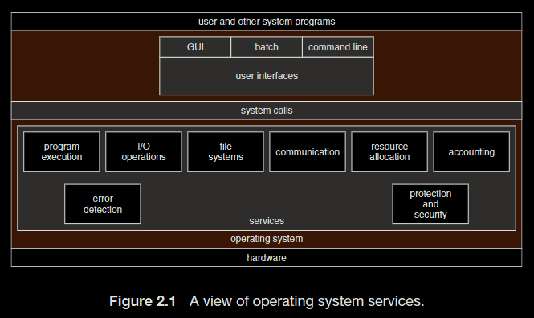

# Basic Concept

Operating System: It is defined as a system that provide an environment to run programs.

System Kernel: Gernerally regarded as the program that offers system calls to call on correspondent system services. It is the first program to be dumped into the memory by booting program. Then it call on other system programs to completely launch the OS, after which user's event will be waited to running user  program.
# Structure

### System Services

A typical OS offers various services like below
- User and OS Interface：command interpreters, Graphic User Interface(GUI), Touch-Screen Interface
	- Popular command interpreter：C shell, Bourne-Again Shell(adopted by linux and unix os), Korn shell
- System calls: System calls are used by program to offer services.
	- Each system call is associated with a number tabled by system call interface.
	- System calls can be grouped roughly into six categories
		- process control, file management, device management,
		- information maintenance, commuications, protection
- System services
	- program execution, I/O operation, file system manipulation,
	- communication, resource allocation, accounting,
	- error detection, protection and security



# Process


A process's status can be grouped as: New, Ready, Running, Waiting, Terminated.

Each process is usually represented by a "Process Control Block", including datas:
- Process status, Program Counter, CPU registers, CPU scheduling informations
- Memory management information, Accounting information, I/O status information


Interprocess communication(IPC) have two models: Shared memory, Message passing.

### Shared memory

As default, processes cannot access the memory of each other, but threads can.

Interprocess communication using shared memory requires communicating
processes to establish a region of shared memory

### Message passing

Since each process has unique pid, `send` and `receive` method can locate the specific process.

```
send(pid, message)
receive(pid, message)
broadcast(message)
receive(message)
```

The synchronization and asynchronization of processes use **blocking** or **nonblocking** primitives.
- blocking send & blocking receive: The process waits until it finishes sending and receive message.
- non blocking send & nonblocking receive: The process resumes after message is sennt and receives either a valid message or null.