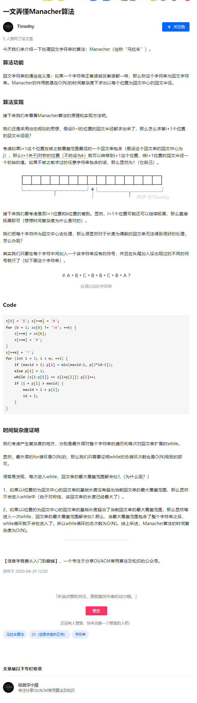

[原文](https://zhuanlan.zhihu.com/p/137172524)

#### 模板

```cpp
char mstr[maxn], str[2*maxn];
int rad[2*maxn];

void manacher(int n){
    n = 2*n-1;
    str[0] = '('; str[n+1] = ')';
    _rfor(i, 1, n) str[i] = (i&1) ? mstr[(i+1)>>1] : '#';
    int mid = rad[1] = 1, r = 2;
    _rfor(i, 2, n){
        if (i < r) rad[i] = min(rad[2*mid-i], r-i)；
        else rad[i] = 1;
        while(str[i+rad[i]] == str[i-rad[i]]) ++rad[i];
        if (i+rad[i] > r) mid = i, r = i+rad[i];
    }
    _rfor(i, 1, n) rad[i] = rad[i]/2;
}
```


