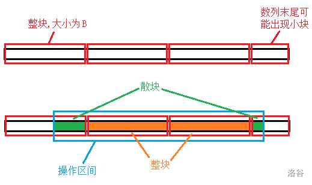

如图（来自 command-block），在分块中有如下概念 :

- 末尾小块 : 因为整个数列划分不整而得到的一个较小的块，可能带来多余的细节。有时可以人为地增长数列将小块变成正常大小的块。
- 整块 : 被操作区间完整覆盖的块。总块数是 $O(n/b)$的。
- 散块 : 被操作区间覆盖了一部分的块。散块包含的元素数目是 $O(b)$ 的。
- 归并函数：归并排序内归并两个有序数组的程序段。

#### 分块能干的事

$(1)$ 在每个块内维护有序列，对散块可以用归并函数 $O(b)$ 维护。

$(2)$ 

- $O(1)$ 单点修改，$O(\sqrt{n})$ 查询区间和，空间 $O(n)$。
- $O(\sqrt{n})$ 单点修改，$O(1)$ 查询区间和，空间 $O(n)$。

$(3)$

- $O(1)$ 插入一个数，$O(\sqrt{n})$ 查询第 $k$ 小，空间 $O(n)$。
- $O(\sqrt{n})$ 插入一个数，$O(1)$ 查询第 $k$ 小，空间 $O(n)$。

这里 $(3)$ 的第二种形式最困难，这里简述实现方法。

维护有序数列，对有序数列按块长 $b$ 分块且保证除了最后一个块外的块均有 $b$ 个数字（数值相同的两个数也各对数字个数有贡献）。

对每个块再维护一个长为 $2b$ 数组，其中长度为 $b$ 的某个子段用来装这个块内维护的有序的 $b$ 个数字。在一开始时这个数组的后面 $b$ 位用来装数字，前面 $b$ 位留空。

这样就能实现 $O(1)$ 查询。

插入一个数字时，先对这个数字所属的块内进行一次插入排序，然后弹出这个块内的最后一个数字，花 $O(b)$，然后这个弹出的数字要插入到后面的块内，对后面的每个块，都会发生在最前端插入以及在最末尾弹出。

这时运用每个块内维护的长为 $2b$ 的数组可以做到对每个块 $O(1)$ 插入与弹出，代价就是每个块内用来装数字的连续段的开头提前一位。

当提前了 $b$ 位时就要对这个块内的这个数组进行 $O(b)$ 重构。

单次插入的时间复杂度为 $O(n/b+b)$。

重构的总时间复杂度可以证明为 $O(n^2/b)$，原因在于每次插入最多只可能导致 $n/b$ 次提前，每提前 $b$ 次就要 $O(b)$ 重构，插入的次数为 $n$，均摊下来单次插入重构复杂度为 $O(n/b)$。

取 $b=\sqrt{n}$ 得到 $O(\sqrt{n})$ 插入， $O(1)$ 查询。

#### 题单

[P5443 [APIO2019]桥梁](https://www.luogu.com.cn/problem/P5443) 操作序列分块+并查集+归并排序。

先将所有操作分块，设块长为 $b$​​。

在枚举每个块时，有关边（被修改操作涉及的边）不超过 $b$​​ 条，于是将所有无关边（未被修改操作涉及的边）和块内询问按重量降序排序，依次处理，每处理到一条无关边就在并查集上合并。

每处理到一个询问时，所有能影响该询问的有关边称作关键边，将所有关键边所涉及的两个端点在并查集上的团拎出来，建图，$\text{dfs}$​​回答询问。

于是回答每个询问用 $O(b)$​​，处理每个块时加入无关边用 $O(m)$​​，对无关边的排序 $O(m+m\log m)$​ 总时间复杂度为 $O(qb+qm/b+m\log m)$​，当 $b=\sqrt{m}$​ 时有最小值 $O(q\sqrt{m} + m\log m)$​​。

[P2801 教主的魔法](https://www.luogu.com.cn/problem/P2801) 设块长为 $b$，在每个整块上维护有序序列。

对于查询操作，每个整块内二分求，每个散块内暴力求，单次时间复杂度 $O((n/b)\log b+b)$。

对于修改操作，每个整块上打懒标记，每个散块上暴力修改，然后用归并函数以 $O(b)$ 排序，单次时间复杂度 $(n/b+b)$，总时间复杂度为 $O(m(n\log b/b+b))$，将 $\log b$ 看作 $\log n$，然后取 $b=\sqrt{n\log n}$ 有 $O(m\sqrt{n\log n})$，在实际实现当中可适当调整块大小以得到更优秀的时间复杂度。

[P5356 [Ynoi2017] 由乃打扑克](https://www.luogu.com.cn/problem/P5356) 区间第 $k$ 大可用二分转化为求区间不超过 $mid$ 的数的个数，与上题类似，修改操作的处理不变，查询操作加多一个二分，但这样单次查询复杂度为 $O((n\log b/b+b)\log R)$，的总时间复杂度为 $O(m\sqrt{n\log n}\log R)$ 其中 $R$ 是数值值域。

考虑对查询操作的优化，整块的处理难以优化，但散块上的暴力还可以从 $b\log R$ 优化成 $b+\log R\log b$，只有在二分值域 $R$ 前先将散块上的数有序提出来，然后将两个散块上的数用归并函数合并，这样在二分值域 $R$ 中对散块的处理就能像对整块的处理一样二分。取 $b=\sqrt{n\log n\log R}$，总时间复杂度为 $m\sqrt{n\log n\log R}$，需要卡常才能过此题。

[P3203 [HNOI2010]弹飞绵羊](https://www.luogu.com.cn/problem/P3203) 这一题涉及到在若干点之间跳跃，很容易让人联想到用倍增来优化跳跃，但本题涉及到修改，倍增无法支持。

倍增难以优化的原因在于每个点可以被 $O(n)$ 个点通过一次数组转移（一次数组转移可能跳了若干步）到达，修改的时候必须将这些点的倍增数组一起修改。

考虑牺牲一些查询的速度，用分块来优化修改操作。设块长为 $b$，在每个块内对每个点维护它要至少跳几步才能跳出这个块，以及它跳出这个块后跳到的下一个点。

对于修改操作，很明显修改操作只会影响到这个块里面的点，$O(b)$ 从后往前枚举并维护就行了，单次修改 $O(b)$。

对于查询操作直接跳即可，单次查询 $O(n/b)$。总时间复杂度 $O(m(b+n/b))$，当 $b=\sqrt{n}$ 时有最小值 $O(m\sqrt{n})$。

[Loj#6546. 简单的数列题](https://loj.ac/p/6546) 设块长为 $b$，当前块为 $blk$，问题的关键在于若将块内 $a_i$ 整体加 $t$，如何快速更新答案。

将 $b_i$ 看成斜率，$a_i$ 看成常量，$t$ 看成自变量，则 $\max\{(a_i+t)b_i|i\in blk\}$ 是分段一次函数，而且是一个凸包。于是考虑在每个块上维护凸包分段点（$O(b)$ 个）、自变量 $t(blk)$、$a_i,b_i(i\in blk)$、该块内的最大值。

对于区间加操作，考虑到加上的值恒正，在处理整块时直接线性往靠后的分段点扫就行，均摊下来单次时间复杂度为 $O(n/b)$，对于散块，直接 $O(b)$ 重新计算凸包分段点就行，单次 $O(n/b+b)$。对于交换操作，直接 $O(b)$ 对两个块计算凸包就行。

总时间复杂度 $O(n^2/b+nb)$，取 $b=\sqrt{n}$ 时有最小值 $O(n\sqrt{n})$。

[P4135 作诗](https://www.luogu.com.cn/problem/P4135) 这个问题与区间众数问题的本质相同。

设块长为 $b$，设出现次数为正偶次的数为好数， $f(i,j)$ 为第 $i$ 块到第 $j$ 块的好数个数，$g(i,x)$ 为前 $i$ 个块中 $x$ 的出现次数，这两个数组都可以以 $O(n^2/b)$ 求出。

利用 $g$ 和前缀和求差能够求出任意 $x$ 在任意块区间 $[i,j]$ 上的出现次数。

查询时，设 $i,j$ 分别为最小、最大整块编号，先取出整块 $[i,j]$ 上的答案 $f(i,j)$，令 $ans=f(i,j)$，注意到散块上的数最多只有 $O(b)$ 种，可以利用 $g$ 去修正 $ans$。

总时间复杂度为 $O(n^2/b+nb)$，取 $b=\sqrt{n}$ 时有最小值 $O(n\sqrt{n})$。$g$ 数组可以用 ```bitset``` 来存储以节省空间。

[P4168 [Violet]蒲公英](https://www.luogu.com.cn/problem/P4168) 在线静态区间众数。与上题类似。时空复杂度为 $O(n\sqrt{n})$。

[P5048 [Ynoi2019 模拟赛] Yuno loves sqrt technology III](https://www.luogu.com.cn/problem/P5048) 同样是在线静态区间众数，但要求空间复杂度 $O(n)$。

考虑优化求散块中的每个数在区间中的出现次数，实际上可以用 ```vector``` 将相同的数装在一起，然后记录原序列里每个数在 ```vector``` 中的位置和 ```vector``` 里每个数在原序列中的位置，分别设为 $p_i$ 与 $q_i$。

每次询问先得到基准答案 $ans=f(i,j)$，然后从左枚举左散块里的数 $a_i$，判断 $p_i+ans$ 对应的 $q_j$ 是否还在范围内，如果是 ```++ans``` 并重新判断，否则下一数。

对右散块的处理类似，从右往左枚举即可。注意到散块最多有 $2b$ 个数，```++ans``` 的次数不超过 $O(b)$ 于是询问复杂度仍不变。  

[P5046 [Ynoi2019 模拟赛] Yuno loves sqrt technology I](https://www.luogu.com.cn/problem/P5046) 在线静态区间逆序对。

对逆序对的处理一般有两种方法——树状数组、归并排序。

在树状数组的方法中，聚焦点是对每个数求出前缀区间内大于它的数，极限为 $O(\log n)$，难以再优化。

但在归并排序中，聚焦点是对两个不相交的区间，求出它们之间的贡献，设两个区间的长度分别为 $l_1,\ l_2$，则归并的复杂度为 $O(l_1+l_2)$，均摊下来每个数的复杂度为 $O(1)$，所以考虑从归并排序入手分块。

分块后，区间可以分成三部分，左散块、整块、右散块，求整个区间的逆序对数除了求这三部分各自内部分的贡献，还要求出不同部分之间的贡献：左散块对整块、右散块对整块、左散块对右散块。

- 首先是整块之间的贡献。

设块长为 $b$，$bl_i,\ br_i,\ blen_i$ 表示第 $i$ 块的左端点位置、右端点位置、长度，$id_x$ 表示原序列位置 $x$ 所在块的编号，$f(i,j)$ 表示从块 $i$ 到块 $j$ 这一个块组成的区间上的逆序对数（$i<j$），$g(i,j)$ 表示块 $i$ 对块 $j$ 的贡献（$i<j$），$s(x)$ 表示原序列上区间 $[1,x]$ 的逆序对数。

$g$ 可以通过对每对块归并排序以 $O(n^2/b)$ 得到，于是
$$
f(i,j)=s(br_j)-s(br_{i-1})-\sum_{k=1}^{i-1}\sum_{l=i}^{j}g(k,l)
$$
 设 $G(i,j)=\sum_{k=1}^{i}\sum_{l=1}^{j}g(k,l)$（若 $k\ge l$ 则认为 $g(k,l)=0$），于是后面那个求和式可以化为
$$
G(i-1,j)-G(i-1,i-1)
$$
这样整块之间的贡献就能 $O(1)$ 查询。

- 然后是散块对整块贡献。

设 $h(x,i)$ 表示原序列上位置 $x$ 上的数对块 $i$ 的贡献（若 $id_x=i$ 则认为 $h(x,i)=0$，否则 $h(x,i)$ 为对应值），利用 $h$ 的前缀和数组 $H(x,i)$（对第一维求前缀和） 可以以 $O(b)$ 求出左散块以及右散块对整块的贡献。

考虑求 $h(x,i)$，对每个块 $i$ 求出 $h(*,i)$，方法是将整个序列分成三个有序段——块 $i$ 左边的区间、块 $i$、块 $i$ 右边的区间，然后用两次 $O(n)$ 的归并排序，复杂度 $O(n^2/b)$。

- 左散块对右散块的贡献。

拎出两个散块上的数以组成两个有序数列，然后 $O(b)$ 归并排序即可。

- 散块内部的贡献。

设 $t(i,x,y)$ 表示第 $i$ 块内的第 $x$ 个数到第 $y$ 个数组成的区间内的逆序对数，则散块内部的贡献可以 $O(1)$ 查询。

考虑求 $t(i,x,y)$，对在每个块 $i$ 内可以以 $O(b^2)$ 求出 $t(i,*,*)$。

- 综上，预处理的时间复杂度是 $O(n^2/b+nb)$，查询的总时间复杂度是 $O(nb)$，取 $b=\sqrt{n}$ 有最小值 $O(n\sqrt{n})$，空间复杂度 $O(n\sqrt{n})$，需要开 ```long long``` 的数组是 $f,\ G,\ s$，它们都是 $O(n)$ 大小的，而达到空间复杂度瓶颈的数组 $h, H, t$ 只需 ```int```，当然求 $s$ 数组需要用到树状数组并以 $O(n\log n)$ 完成。 

这种方法大量运用了归并排序，常数巨大且实现复杂，下面给出更简便的方法。

考虑优化树状数组方法的时间复杂度，$O(\log n)$，的原因在于动态维护前缀和，如果能化动态为静态就能去掉 $\log n$。

设 $F(x,i)$ 表示原序列上的区间 $[1,x]$ 对块 $i$ 的贡献（若 $[1,x]$ 与块 $i$ 相交则认为 $F(x,i)=0$）。

于是
$$
g(i,j)=F(br_i,j)-F(br_{i-1},j)\\
H(x,j)=F(x,j)\\
$$
考虑求 $F$，因为 $F$ 实际上就是 $H$，我们先求出 $h$ 然后再前缀和得到 $F$。

求 $h(*,i)$，我们不用归并排序，而是先将块 $i$ 里的数值插入到桶里，$O(n)$ 求桶的前缀和，然后对每个数就能 $O(1)$ 求出对块 $i$ 的贡献。

于是整块之间的贡献、散块对整块的贡献不通过归并排序也能实现 $O(n^2/b+nb)$ 预处理、$O(b)$ 查询。

至于散块对散块的贡献、散块内部的贡献与原来的方法一致。

[P4278 带插入区间K小值](https://www.luogu.com.cn/problem/P4278) 首先说明一下权值分块树的定义，它与权值线段树类似，只不过是 $\sqrt{w}$ 叉树，一共有三层，其中 $w$ 为值域大小。

这样的结构决定了这样的结构决定了它能实现 $O(1)$ 插入一个权值，$O(\sqrt{w})$ 查询第 $k$ 大。

这一题，既涉及单点修改、又涉及单点插入，树状数组套权值线段树无法完成，只能考虑用块状链表。

对原序列分块，块长 $b$，每个块内维护一颗权值分块树，该权值分块树维护不是本块内的数值，而是维护前缀块内的数值。

- 单点修改时需要维护前缀和，而对权值分块树的插入是 $O(1)$，故单次单点修改 $O(n/b)$。

- 查询时将散块内的数插入到另一个空置的权值分块树，然后用类似于主席树查询区间 $k$ 小值的方法查询，单次查询 $O(b+\sqrt{w})$。

- 插入数时需要首先要维护前缀和，花 $O(n/b)$。每当一个块大小达到 $2B$ 时就要进行分裂，一次分裂的时间复杂度为 $O(w)$，总分裂次数为 $O(n/b)$，均摊下来单次插入分裂复杂度为 $O(w/b)$。

总时间复杂度 $O(qn/b+q(b+\sqrt{w})+wn/b)$，注意到本题中 $w$ 与 $n$ 与 $q$ 同阶，取 $b=\sqrt{n}$ 有最小值 $O(n\sqrt{n})$。 

[P5063 [Ynoi2014] 置身天上之森](https://www.luogu.com.cn/problem/P5063) 先化简问题：区间加、区间查询某元素的排名。这是分块中经典的问题，可以做到 $O(n\sqrt{n\log n})$，然后推广到线段树上，将线段树上的每一层看作一个序列，对每层分别分块。注意到每向上一层节点数就会减半，所以总时间复杂度仍为 $O(n\sqrt{n\log n})$。为了减小常数，线段树最顶上的若干层可以不分块，比如取前 $7$ 层，大约 $128$ 个节点，查修时暴力计算这些节点的贡献和维护这些节点的值。因为归并的时间复杂度较高，可以适当减小块长以获得更好的常数。


