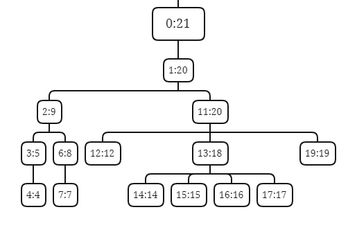
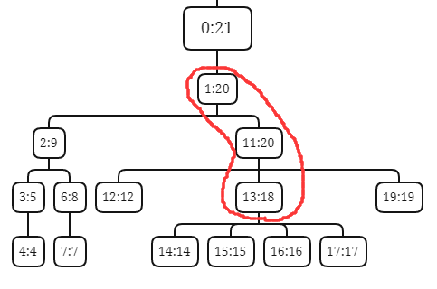
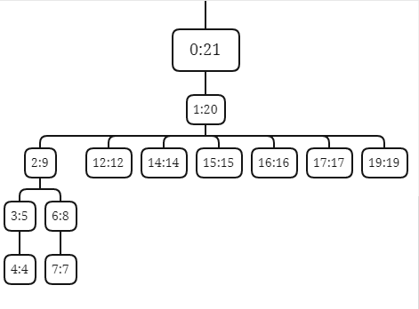
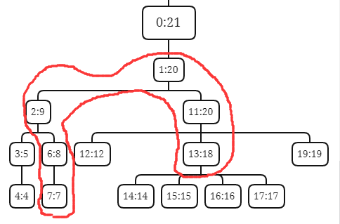
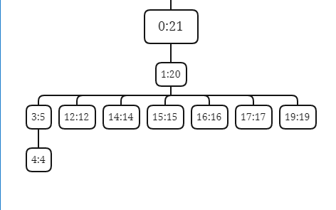
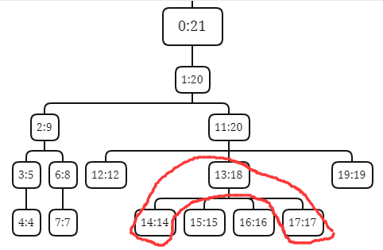
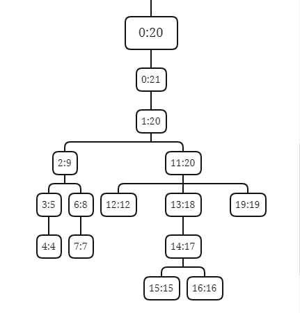

本文起笔于```2021.12.07```。

[CF1578B Building Forest Trails](https://www.luogu.com.cn/problem/CF1578B)

难度应该在紫，但很考码力，难点都在代码实现方面了，然鹅写完题后发现题解比题更难写。

知识点：并查集 + $\text{FHQ Treap}$。

不难想到用并查集来回答查询，所以问题的关键转化为每次连边时要将哪些集合合并。

具体一点，给定一条将要连的边 $(l,r)$ 不妨设 $l<r$，我们需要快速知道 $(l,r)$ 穿过哪些集合，然后将这些集合合并起来，这样就能保证时间复杂度正确。

若要判断边 $(l,r)$ 是否穿过一个集合 $S$，则需判断在使得 $S$ 连通的那组边中，是否存在一条与 $(l,r)$ 相交的边 $(tl,tr)$ （端点相交也算相交），而判断两条边是否相交则相当于判断两条边对应的区间是否有重叠的部分（在端点处重叠也算相交）。 

容易注意到，我们并不需要关心是哪些边使这个集合连通起来，因为若 $(l,r)$ 穿过集合 $S$，则不管是哪组边将 $S$ 连通起来的，$(l,r)$ 肯定会与这组边的其中之一相交。

为了方便我们求解问题，我们可以为每个集合选取一组代表边，比如对于集合 $S=\{1,4,5,8,12\}$，我们选取 $(1,4),(4,5),(5,8),(8,12)$ 作为代表边，即选取首尾相接的边，这样选取的优点是这些边只在端点处相交，省去了很多麻烦。

下一步就有点难说明了，只能上图，意思是在仅连代表边时，集合们之间的关系可以构成一颗树，相信从图中不难看出这颗树是如何构建出来的。

下图中是连边后代表边集为 $(1,10),(10,20)\ ||\ (2,9)\ ||\ (3,5)\ ||\ (6,8)\ ||\ (11,20)\ ||\ (13,18)$ 的结果，其中分划线分开了不同的集合。

建议先在草稿纸上画围成圈的 20 个点，连上边后再对照下图（我不会高级的作图工具，只能将就将就了/xk），根节点是一个为了方便代码实现而设的虚节点。



我们暂且称这颗树为区间段树，树上的每一个点都代表一个连通的集合 $S$，每一个点都存有这个集合的跨度，即这个集合包含的最小节点编号 $le$ 以及最大节点编号 $ri$，称 $[le,ri]$ 为 $S$ 对应的区间， 以下用集合对应的区间指代这个集合，图中节点上的区间代表了对应集合的跨度。

这颗树之所以可以建出来，是因为集合们对应区间之间的关系要么是包含要么是相离。

然后我们用 $son(S)$ 表示集合 $S$ 在区间段树上对应的儿子们，$son(S)$ 可以用 $\text{FHQ Treap}$ 维护（注意 $\text{FHQ Treap}$ 维护的是某个集合的儿子集，不是维护区间段树，所以区间段树上每个节点都对应了一颗 $\text{FHQ Treap}$）。

现在我们思考连边会对这颗树造成什么影响？

#### 情况一



连边 $(10,13)$，边的两端点所在集合分别为 $[1:20]$ 和 $[13:18]$，这种情况下，这两个集合在区间段树上的路径是一条从上往下的链。

此时链上的每个集合就是要合并的集合，所有集合合并到 $\text{LCA}$（$[1:20]$），而且所有集合的儿子们都要成为 $\text{LCA}$ 的儿子（要合并儿子集）。

合并后区间段树变为



代表边集变为 $(1,10),(10,13),(13,18),(18,20)\ ||\ (2,9)\ ||\ (3,5)\ ||\ (6,8)$。

#### 情况二



连边 $(7,13)$，边的两端点所对应的集合分别为 $[7:7]$ 和 $[13:18]$，这种情况下，这两个集合在区间段树上的 $\text{LCA}$（$[1:20]$）不是两个集合的其中之一，且最靠近 $\text{LCA}$ 的两个集合 $S_u=[2:9],S_v=[11:20]$ 之间有空隙（$10$ 不存在）。

此时链上的每个集合都要合并到 $\text{LCA}$，而且所有集合的儿子们都要成为 $\text{LCA}$ 的儿子。

合并后区间段树变为



代表边集变为 $(1,2),(2,6),(6,7),(7,8),(8,9),(9,10),(10,13),(13,18),(18,20)\ ||\ (3,5)$。

#### 情况三



连边 $(14,17)$，边的两端点所对应的集合分别为 $[14:14]$ 和 $[17:17]$，这种情况下，这两个集合在区间段树上的 $\text{LCA}$（$[13:18]$）不是两个集合的其中之一，且最靠近 $\text{LCA}$ 的两个集合 $S_u=[14:14],S_v=[17:17]$ 之间没有空隙（$15,16$ 都存在）。

此时链上的每个集合除 $\text{LCA}$ 外都要合并到一起，成为一个新的集合，而且所有参与合并的集合（不包括 $\text{LCA}$）的儿子们都要成为新集合的儿子，而且 $S_u$ 与 $S_v$ 中间连续的那一段（$[15:15],[16:16]$）也要成为新集合的儿子，最后这个新集合成为 $\text{LCA}$ 的儿子。

合并后区间线段树变为



代表边集变为 $(1,10),(10,20)\ ||\ (2,9)\ ||\ (3,5)\ ||\ (6,8)\ ||\ (11,20)\ ||\ (13,18)\ ||\ (14,17)$。

#### 情况四

连边 $(10,20)$，边的两端的对应的集合为同一个，即 $[1:20]$，这种情况相当于什么事都没干，区间线段树的结构也不会改变，忽略即可。

#### 代码实现

算法的描述完成了，代码实现才是最难的，好像更难讲了，这里只能简略谈一下核心思想。

每个集合的儿子集是一颗 $\text{FHQ Treap}$，因为每次在区间段树上将儿子集合合并，都是从下往上合并的，于是这可以用 $\text{FHQ Treap}$ 的分裂及合并操作以单次合并 $O(\log n)$ 完成。

对于在区间段树上求 $\text{LCA}$ 及 $S_u,S_v$，则可通过暴力跳父亲的方式求出，所以需要在每颗 $\text{FHQ Treap}$ 的根节点处记录这颗 $\text{FHQ Treap}$ 是哪个集合的儿子集合。并且在每个集合 $S$ 在其父亲的儿子集中有一个 $\text{FHQ Treap}$ 节点 $nd(S)$，我们也需要在 $S$ 上记录 $nd(S)$（之所以不直接记录这个集合 $S$ 在区间段树上的父亲是谁，是因为在修改操作中对区间段树结构的修改会改变很多父子关系）。

然后在 $\text{FHQ Treap}$ 从 $nd(S)$ 往上跳，跳到根节点，再通过根节点上记录的信息得知这颗 $\text{FHQ Treap}$ 是谁的儿子集，也就知道到了在区间段树上 $S$ 的父亲是谁，在区间段树上找某个集合的父亲以单次 $O(\log n)$ 完成。

至于如何区分情况二和情况三，即如何得知 $S_u$ 与 $S_v$ 之间是否连续，则需要在 $\text{FHQ Treap}$ 上多维护一个标记 $tag$，代表这个$\text{FHQ Treap}$ 里是否连续，于是可在 $S_u$ 与 $S_v$ 的 $\text{LCA}$ 的儿子集合中先分裂出包含 $S_u$ 和 $S_v$ 的那一颗 $\text{FHQ Treap}$，然后通过根节点的 $tag$ 快速判断，这一步也是单次 $O(\log n)$。

因为集合们最多合并 $n-1$ 次，每次合并中上述三个 $O(\log n)$ 的操作会各进行 $O(1)$ 次，所以总时间复杂度为 $O(n\log n)$。

当然，这颗 $\text{FHQ Treap}$ 实在太复杂了， 常数也会有点大，时限开 $3s$ 并不过分。

CF 上提交 $AC$ 了，但在洛谷上提交 $UKE$ 了，不知道为什么。


```6k```代码如下

```cpp
#include <stdio.h>
#include <algorithm>
#include <string.h>
#include <iostream>
#include <assert.h>
#include <random> 
using namespace std;

#define re register
#define sf scanf
#define pf printf
#define nl() putchar('\n')
#define ms(x, val) memset(x, val, sizeof(x))
#define ll long long
#define _for(i, a, b) for(re int (i) = (a); (i) < (b); ++(i))
#define _rfor(i, a, b) for(re int (i) = (a); (i) <= (b); ++(i))
#define _fev(p, u) for(re int (p) = head[(u)]; (p); (p) = nex[(p)])
#define inf 0x7fffffffffffffffll
#define maxn 200005
#define maxnn (4*maxn)

template <class T>
void print(string name, T arr[], int n, int flag = 1){
	cout<<name<<":";
	_for(i, 0, n)cout<<" "<<arr[i+flag];
	cout<<endl;
}

int rdnt(){
	re int x = 0, sign = 1;
	re char c = getchar();
	while (c < '0' || c > '9') { if (c == '-') sign = -1; c = getchar(); }
	while (c >= '0' && c <= '9') x = (x<<3) + (x<<1) + (c ^ 48), c = getchar();
	return x * sign;
}

mt19937 engine(315);
uniform_int_distribution<ll> dstr(0, inf);
ll randnt(){ return dstr(engine); }

int pcnt = 0, pool[maxnn];
struct Union{ int nd, uf, le, ri, rt; } union_[maxn];
struct Treap{ int bl, fa, vl, sz, lc, rc, L, R; bool tag; ll pri; } treap[maxnn];
#define nd(x) union_[x].nd
#define uf(x) union_[x].uf
#define le(x) union_[x].le
#define ri(x) union_[x].ri
#define rt(x) union_[x].rt
#define bl(x) treap[x].bl
#define fa(x) treap[x].fa
#define vl(x) treap[x].vl
#define sz(x) treap[x].sz
#define lc(x) treap[x].lc
#define rc(x) treap[x].rc
#define tag(x) treap[x].tag
#define R(x) treap[x].R
#define L(x) treap[x].L
#define pri(x) treap[x].pri
int new_node(re int nn){ re int x = pool[pcnt--]; treap[x] = treap[nn]; pri(x) = randnt(); return x; }
void del_node(re int x){ pool[++pcnt] = x; }

int stk[maxn];
int find(re int u){
	re int top = 0;
	while(uf(u) > 0) stk[top++] = u, u = uf(u);
	while(top) uf(stk[--top]) = u;
	return u;
}

//void print(int x, int dep = 0){
//	_for(i, 0, dep) pf("\t");
//	if (x == 0){ pf("none\n"); return; }
//	pf("bl:%d vl:%d sz:%d tag:%d L:%d R:%d\n", bl(x), vl(x), sz(x), tag(x), L(x), R(x));
//	print(lc(x), dep+1);
//	print(rc(x), dep+1);
//}
//
//void dfs(int x, vector<int> &vec){
//	if (!x) return;
//	dfs(lc(x), vec);
//	vec.push_back(vl(x));
//	dfs(rc(x), vec);
//}

bool cmp(re int v1, re int v2){ return le(v1) < le(v2); }

void ud(re int x){
	sz(x) = 1; tag(x) = true;
	if (lc(x)){
		tag(x) &= tag(lc(x)) && R(lc(x))+1 == le(vl(x));
		sz(x) += sz(lc(x));
		L(x) = L(lc(x));
		fa(lc(x)) = x;
		bl(lc(x)) = -1;
	}
	else L(x) = le(vl(x));
	if (rc(x)){
		tag(x) &= tag(rc(x)) && ri(vl(x))+1 == L(rc(x));
		sz(x) += sz(rc(x));
		R(x) = R(rc(x));
		fa(rc(x)) = x;
		bl(rc(x)) = -1;
	}
	else R(x) = ri(vl(x));
	fa(x) = 0;
}

void split(int x, int v, int &ltr, int &rtr, bool fg){
	if (!x){ ltr = rtr = 0; return; }
	bool judge = (fg?vl(x)==v:false) || cmp(vl(x), v);
	if (judge){
		ltr = x;
		split(rc(x), v, rc(ltr), rtr, fg);
		ud(ltr);
	}
	else{
		rtr = x;
		split(lc(x), v, ltr, lc(rtr), fg);
		ud(rtr);
	}
}

int merge(int x, int y){
	if (!x || !y){ if (x+y != 0) ud(x+y); return x+y; }
	if (pri(x) <= pri(y)){
		rc(x) = merge(rc(x), y); ud(x);
		return x;
	}
	else{
		lc(y) = merge(x, lc(y)); ud(y);
		return y;
	}
}

void ins(int &x, int v){
	re int ltr = 0, rtr = 0, d = new_node(0);
	sz(d) = 1; vl(nd(v) = d) = v; tag(d) = true; L(d) = le(v); R(d) = ri(v);
	split(x, v, ltr, rtr, false);
	x = merge(merge(ltr, d), rtr);
}

void del(re int &rt, re int v){
	if (!rt) return;
	re int ltr = 0, mtr = 0, rtr = 0;
	split(rt, v, ltr, mtr, false);
	split(mtr, v, mtr, rtr, true);
	rt = merge(ltr, rtr);
	nd(v) = 0;
	if (mtr) del_node(mtr);
}

bool unite(re int u, re int v){
	uf(u) += uf(v);
	uf(v) = u;
	nd(v) = le(v) = ri(v) = 0;
	return true;
}

void ud_bl(re int x){
	if (rt(x)) bl(rt(x)) = x;
}

int get_uf_fa(re int x){
	x = nd(x);
	while(fa(x)) x = fa(x);
	return bl(x);
}

void go_up(re int x, re int v){
	while(x != v){
		re int pa = get_uf_fa(x), ltr = 0, mtr = 0, rtr = 0;
		split(rt(pa), vl(x), ltr, mtr, false);
		split(mtr, vl(x), mtr, rtr, true);
		del_node(mtr);
		rt(pa) = merge(merge(ltr, rt(x)), rtr);
		ud_bl(pa); unite(pa, x); rt(x) = 0;
		x = pa;
	}
}

//void print_tree(int x, int dep = 0){
//	_for(i, 0, dep) pf("\t");
//	pf("x:%d le:%d ri:%d fa:%d\n", x, le(x), ri(x), x==0?-1:get_uf_fa(x)); 
//	vector<int> vec;
//	dfs(rt(x), vec);
//	for(auto i : vec) print_tree(i, dep+1);
//}

int main(){
//	#ifndef ONLINE_JUDGE
//	freopen("sample.in", "r", stdin);
//	freopen("sample.out", "w", stdout);
//	#endif
	
	uf(0) = -1;
	_for(i, 1, maxnn) pool[++pcnt] = maxnn-i; 
	bl(0) = fa(0) = -1; sz(0) = vl(0) = lc(0) = rc(0) = tag(0) = L(0) = R(0) = 0;
	
	re int n = rdnt(), m = rdnt();
	le(0) = 0; ri(0) = n+1;
	_rfor(i, 1, n){
		uf(i) = -1, le(i) = ri(i) = i, rt(i) = 0;
		ins(rt(0), i);
	}
	ud_bl(0);
	
	_rfor(i, 1, m){
		re int opt = rdnt(), l = rdnt(), r = rdnt();
		if (opt == 2) pf("%d", find(l) == find(r));
		else if (opt == 1){
			if (l > r) swap(l, r);
			re int u = find(l), v = find(r), tu, tv, lca, tar, tmp = u;
			if (u == v) continue;
			
			while(!(l >= le(tmp) && r <= ri(tmp))) tmp = get_uf_fa(tmp);
			if (tmp == u || tmp == v){
				lca = tar = tmp;
				go_up(u, lca); go_up(v, lca);
			}
			else{
				re int ltr = 0, mtr = 0, rtr = 0;
				lca = tmp; tu = u; tv = v;
				while((tmp = get_uf_fa(tu)) != lca) tu = tmp;
				while((tmp = get_uf_fa(tv)) != lca) tv = tmp;
				split(rt(lca), tu, ltr, mtr, false);
				split(mtr, tv, mtr, rtr, true);
				if (tag(mtr)){
					ri(tu) = ri(tv);
					del(mtr, tu); del(mtr, tv);
					ud_bl(tu); ud_bl(tv);
					go_up(u, tu); go_up(v, tv);
					rt(tu) = merge(merge(rt(tu), mtr), rt(tv));
					rt(tv) = 0;
					unite(tu, tv); ud_bl(tu);
					re int d = new_node(0);
					sz(d) = 1; vl(nd(tu) = d) = tu; tag(d) = true; L(d) = le(tu); R(d) = ri(tu);
					rt(lca) = merge(merge(ltr, d), rtr);
				}
				else{
					tar = lca;
					rt(lca) = merge(merge(ltr, mtr), rtr);
					go_up(u, lca); go_up(v, lca);
				}
			}
			ud_bl(lca);
		}
	}

	return 0;
}

```
