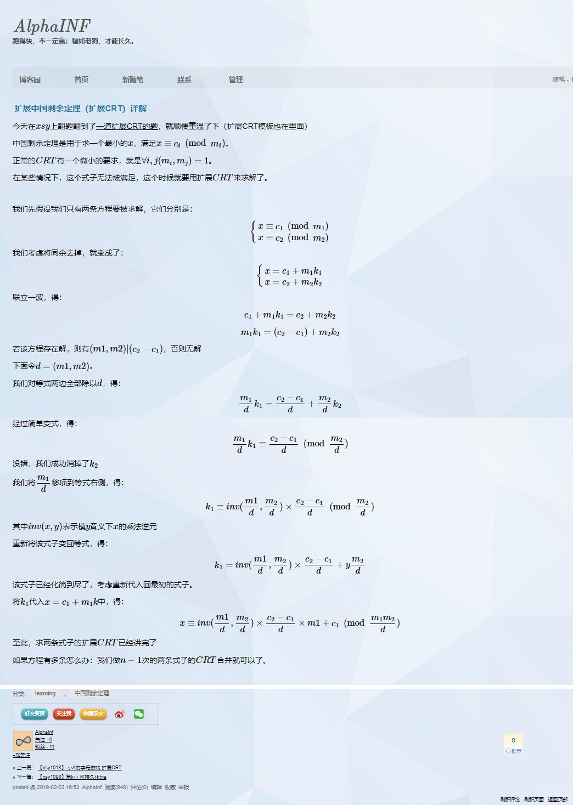

[原文](https://www.cnblogs.com/xiefengze1/p/10350652.html)



```cpp
ll mul(re int ll a, re ll b, re ll m){ return ((a*b-(ll)((long double)a*b/m)*m)%m+m)%m; }
ll gcd(re ll a, re ll b){ while(b) a%=b, a^=b^=a^=b; return a; }

void exgcd(ll a, ll b, ll &g, ll &x, ll &y){
	if (!b) g = a, x = 1, y = 0;
	else exgcd(b, a%b, g, y, x), y -= x*(a/b);
}

ll get_inv(re ll a, re ll p){
	re ll g, x, y;
	exgcd(a, p, g, x, y);
	if (g != 1) return -1;
	return (x%p+p)%p;
}

struct exCRT{
	ll a[maxn], m[maxn];
	ll solve(re int n){
		re ll M = m[1], x = a[1];
		_rfor(i, 2, n){
			if (x % m[i] == a[i]) continue;
			re ll g = gcd(M, m[i]), mm = M/g*m[i];
			x = mul(mul(get_inv(m[i]/g, M/g), m[i], mm), (x>a[i]?x-a[i]:mm-a[i]+x)/g, mm)+a[i];
			if (x >= mm) x -= mm; M = mm;
		}
		return x;
	}
} crt;
```