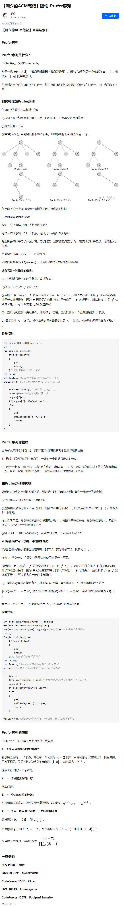

[原文](https://zhuanlan.zhihu.com/p/344779506)



当题目涉及到带标号的无向图或有向图时可以考虑 $\text{prufer}$ 序列

[模板题](https://www.luogu.com.cn/problem/P6086)代码：

```cpp
int 
	fa[maxn],
	
	pcnt = 0,
	pru[maxn],
	
	in[maxn],	
	inpru[maxn];

int main(){
	re int n = rdnt(), m = rdnt();
	if (m == 1){
		_rfor(i, 1, n-1) ++in[fa[i] = rdnt()];
		for(int i = 1, j = 1; i <= n-2; ++i, ++j){
            while(in[j]) ++j; pru[i] = fa[j];
            while(i <= n-2 && !--in[pru[i]] && pru[i] < j) pru[i+1] = fa[pru[i]], ++i;
        }
		re ll ans = 0;
		_rfor(i, 1, n-2) ans ^= (ll)i*pru[i];
		pf("%lld\n", ans);
	}
	else{
		_rfor(i, 1, n-2) ++inpru[pru[i] = rdnt()];
		++inpru[pru[n-1] = n]; pru[n] = 0;
		for(int i = 1, j = 1; i < n; ++i, ++j){
            while(inpru[j]) ++j; fa[j] = pru[i];
            while(i < n && !--inpru[pru[i]] && pru[i] < j) fa[pru[i]] = pru[i+1], ++i;
        }
		re ll ans = 0;
		_rfor(i, 1, n-1) ans ^= (ll)i*fa[i];
		pf("%lld\n", ans);
	}
	
	return 0;
}