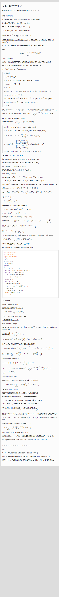

给定集合 $S$ ，则有：
$$
\max{S} = \sum_{T\in S,T\neq \empty} \min T
$$
对于期望或概率，也有类似的公式：
$$
E(\max{S}) = \sum_{T\in S,T\neq \empty} E(\min T)
$$
其中 $E(\max{S})$ 表示 $S$ 最大值的期望，$E(\min T)$ 表示 $T$ 中最小值的期望。

常见的 trick 有 $S$ 表示各个元素出现时间的集合，则所有元素均出现的期望时间为 $E(\max S)$ ，至少出现一个元素的期望时间为 $E(\min S)$，这可以套用上述的 $\text{Min-Max}$ 容斥公式。

#### 例题1：

题面：给定 $n$ 个元素，每一时刻第 i 个元素都有 $p_i$ 的概率出现，求全部元素均已出现过的期望时间。

令 $S$ 表示每个元素出现时间的集合，直接套用公式，则问题转化为对 $S$ 的每个子集 $T$ 求 $E(\min T)$​。

不妨设 $T = \{x_j | 1\leq j \leq k\}$ 。

单个时刻 $T$ 中所有元素均不出现的概率为：
$$
P_T =\prod_j^k (1-p_{x_j})
$$
那么就有：
$$
\begin{aligned}
E(\min T) = &\sum_{i=1}^{+\infty} i\cdot {P_T}^{i-1}\cdot (1-P_T)\\
=&\frac{1-P_T}{P_T}\cdot \sum_{i=1}^{+\infty} i\cdot {P_T}^i\\
=&\frac{1}{1-P_T}
\end{aligned}
$$
其中有个常用的公式及其推论：
$$
\sum_{i=1}^{t} i\cdot p^i = \frac{p}{1-p}\cdot(\frac{1-p^t}{1-p}-t\cdot p^t)\\
\sum_{i=1}^{+\infty} i\cdot p^i = \frac{p}{(1-p)^2}\\
$$
参考：

[Min-Max容斥小记](https://www.luogu.com.cn/blog/command-block/min-max-rong-chi-xiao-ji)

