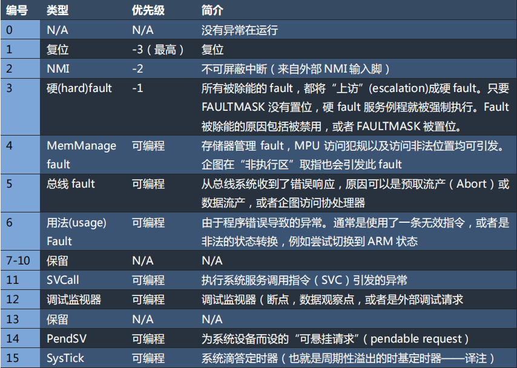

# CortexM3 中断

关于中断需要了解：
- fault 大致有哪些
- 中断优先级机制
- 中断建立与中断控制(配置中断优先级，向量表，查询中断状态，控制中断的触发)
- 中断调用、返回
- 如何根据任务设计多级中断嵌套系统

**fault 大致有** NMI、硬 fault、MemManage fault、总线 fault、用法 fault、SVC、调试、PendSV、SysTick

**中断优先级机制**

cortexM3 采用 8 位描述一个中断或异常的优先级，同时这8位被分成了**抢占优先级**和**次优先级**两段，前者占高位的段，后者占低位的段，根据 PRIGROUP(AIRCR 寄存器的 8-10 位)来控制两段的占多少位。设计上 PRIGROUP 刚好等于 次优先级所占位数减一。

芯片实现中，允许用更少的位(至少为3位)表达优先级，少的位数从低比特开始扣，也就是说次优先级所占位数可能被减成 0，如 stm32 系列芯片用 4 位表达优先级，当 PRIGROUP 小于 4 时没有次优先级。

当多个中断或 fault 并发时，优先级影响了处理顺序。

抢占优先级决定了抢占行为：当系统正在响应某异常 L 时，如果来了抢占优先级更高的异常 H，则 H 可以抢占 L。次优先级则影响中断调度：当抢占优先级相同的异常有不止一个悬起时，就优先响应次优先级最高的异常。如果优先级完全相同的多个异常同时悬起，则先响应异常编号最小的那一个。

##### 中断控制

- 中断屏蔽寄存器：通过 mrs 与 msr 指令来读写
	- `PSIMASK`：只能为 0 和 1，后者时关闭可屏蔽异常，只响应 NVI 和硬 fault
	- `FAULTMASK`：只能为 0 和 1，后者时关闭所有异常与软中断，只响应 NVI
	- `BASEPRI`：除了为 0 时不关闭任何中断，关闭优先级大于该值的中断，不影响 fault

这些寄存器集合到了 SCB 结构体中：
- SHCSR, ICSR, SHPR, VTOR, AIRCR
NVIC 结构体中
- ISER/ICER, ISPR/ICPR, IABR, IP, STIR

SHCSR(系统Handler控制及状态寄存器)：
- 控制 MemManageFault, UsageFault, BusFault 的使能
	- MEMFAULTENA, USGFAULTENA, BUSFAULTENA
- 查看 MemManageFault, UsageFault, BusFault, SVC 的悬起状态
	- MEMFAULTPENDED, USGFAULTPENDED, BUSFAULTPENDED, SVCALLPENDED 
- 查看 MemManageFault, UsageFault, BusFault, SVC, PendSV, Monitor 的激活状态
	- MEMFAULTPENDED, USGFAULTACT, BUSFAULTACT, SVCALLACT, PENDSVACT, MONITORACT
SHCSR 寄存器的位都是 R/W 的，但写入操作及其危险，仅在某些特殊场合需要写。

SHP(系统Handler优先级寄存器)

ICSR(中断控制及状态寄存器)：
- 悬起 NMI, PendSV, SysTick，R/W
	- NMIPENDSET, PENDSVSET, PENDSTSET
- 查看 PendSV, SysTick 的悬起状态，R/W
	- 读取 PENDSVSET, PENDSTSET 位
- 清除 PendSV, SysTick 的悬起状态，仅 W
	- PENDSVCLR, PENDSTCLR
- 查看 优先级最高的悬起的 ISR 的编号，正在活动的 ISR 的编号，R
	- VECTPENDING, VECTACTIVE

NVIC：
- ISER/ICER：使能与除能，均是写1有效，写0无效，R/W，对同一软中断，SETENA与CLRENA的对应位不可能同时为 1
	- 如果芯片实现不支持某中断，则对 ISER 写 1 也无效，这一特性可以用来求出芯片支持多少中断
- ISPR/ICPR：悬起与解悬，特性类似 ISER/ICER
- IABR：查看中断激活状态，仅 R
- IP：240 个外部中断的的优先级的设置与查看
	- 如果芯片实现支持的优先级位数小于 8，则读入 IP 时未支持的位永远为 0，这个特性可以用来求芯片支持的优先级位数
- STIR：写入 n 时，悬起中断 n（ISR 编号为 16+n），USERSETMPEND 缺省时，用户态不允许写入该寄存器

SysTick：
SysTick 模块维护了一个 24 位的递减计数器，它芯片
- CTRL(中断控制及状态寄存器)
	- ENABLE：RW，使能 SysTick 计数器，置 0 时计数器将不再递减
	-  TICKINT：RW,，使能计数归0时产生 SysTick 异常
	- CLKSOUCE：RW，0 时外部时钟源(STCLK)，1时内部时钟源(FCLK)
	- COUNTFLAG：R，当 VAL 为 0 即计数器归零时 COUNTFLAG 为 1。读取 COUNTFLAG 会将它置 0，VAL 不为 0 时 COUNTFLAG 也会置 0
- LOAD(重装数组寄存器)
	- 当 VAL 为 0 时，RW，下一次触发时重新装载仅计数器的值。如果想 n 次触发时产生 SysTick，VAL 应写入 n-1
- VAL(当前数值寄存器)
	- 仅 R
- CALIB(校准数值寄存器)
	- TENMS：10ms 的校准值（芯片厂商预设，如 72MHz 芯片 TENMS=719999）
	- SKEW：R，1 代表校准值不是准确的 10ms，0 代表是准确的 10ms
	- NOREF：R，1 代表没有外部时钟即 STCLK 不可用，0 代表可用

##### 中断调用与中断返回

cortex M3 中，内核分 线程模式 和 Handler 模式，特权级分 特权态 和 用户态。

中断调用发生时，有两种情况
（1）线程模式 -> Handler 模式
（2）Handler模式 -> Handler 模式，高优先级抢占了低优先级

中断/异常的响应过程包括
1. 入栈：将 8 个寄存器入栈
2. 取向量：从向量表中找出对应的服务程序入口地址
3. 进中断：选择堆栈指针MSP/PSP，更新堆栈指针SP，更新连接寄存器LR，更新程序计数器PC
4. 响应：执行响应程序
5. 出中断：还原 SP，LR，PC
6. 出栈：将 8 个寄存器出栈
其中 8 个寄存器在栈中的位置从高到低依次是
- xPSR, PC, LR, R12, R3, R2, R1, R0

arm 指令集通过特殊的设计，使中断程序的返回指令可沿用普通函数的返回指令(`BX <reg>`, `POP {PC}`, `POP {...,PC}`, `LDR PC`, `LDM`等)。
当内核处于 Handler 模式时，更新 PC 的值有了区别于指令地址的新的解释，命名为 EXC_RETURN
其中，CM3 必须为 Thumb 状态，即合法的 EXC_RETURN 值只有 0xFFFF_FFF1, 0xFFFF_FFF9, 0xFFFF_FFFD
![[exc_return位段解释.png]]

##### 中断建立

AIRCR(应用程序中断及复位控制寄存器)：
- VECTRESET：仅 W，置 1 时对 cortex M3 内核进行复位，范围覆盖了整个 CM3 处理器中，除了调试逻辑之外的所有角落，不会影响到 CM3 处理器外部的任何电路
- VECTCLRACTIVE：仅 W，清零所有异常的活动状态信息。通常只在调试时用，或者在 OS 从错误中恢复时用。
- SYSRESETREQ：仅 W，置 1 时会复位 cortex M3 内核与片上外设，片上外设会回复成什么取决于芯片制造商
- PRIGROUP：R/W，设定抢占优先级与次优先级各占多少位
- ENDIANESS：仅 R，大小段指示器，1 时大端，0 时小端
- VECTKEY：访问钥匙：R/W，任何对该寄存器的写操作，都必须同时把 0x05FA 写入此段，否则写操作被忽略。若读取此半字，则 0xFA05。

从 SYSRESETREQ 被置为有效，到复位发生器执行复位命令，往往会有一个延时。在此延时期间，处理器仍然可以响应中断请求，这不是本意，所有最好在发出复位请求前，先把FAULTMASK 置位。

VTOR向量表偏移量寄存器)
- TBLBASE：向量表在 Code 区(0) 还是 RAM 区(1)，RW
- ENDIANESS

# stm32 中断

在 cortex M3 中断的基础上，stm32 对中断有了进一步的规划。