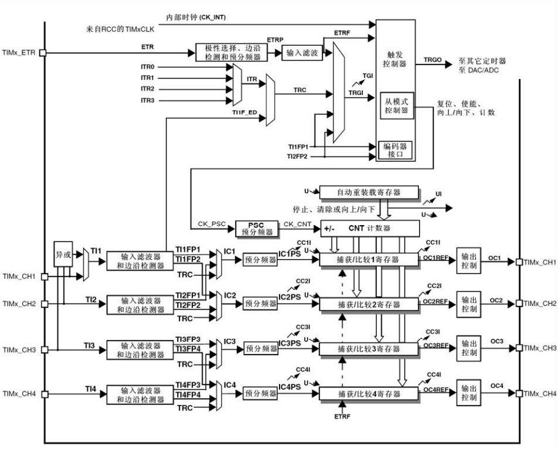
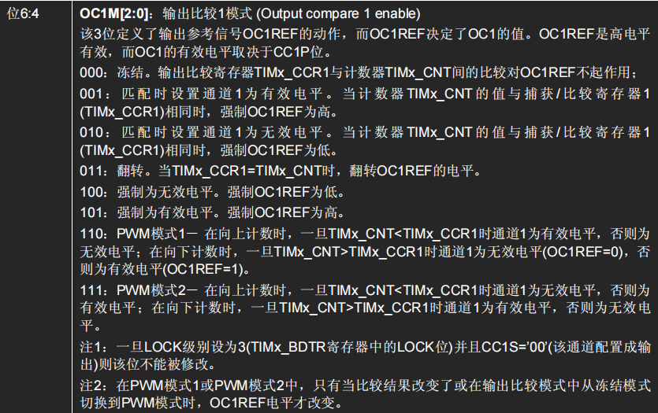

# TIM

16 位预分频定时器
### 基本定时器：TIM6~TIM7

输入预分频器，输出预分频器

### 通用定时器：TIM2~TIM5

主要用途
- 定时产生中断 / DMA 请求
- 输出 PWM 波
- 测量输入信号的频率和占空比

在 TIMx_ARR 向上或向下溢出时，产生事件 UEV，通过设置可触发中断（UIF标志，需软件清空）或 DMA 请求

##### 时基配置
- 控制寄存器1 TIMx_CR1
	- CEN：使能计数器
		- 默认时钟为内部时钟 CK_INT，特殊的，当 APB1_CLK 被分频时，为 2 * APB1_CLK，不分频时为 APB1_CLK
	- UDIS：置 1 时禁止 UEV 产生，但不影响计数
	- URS：选择中断或DMA请求的产生的事件源，置 0 时计数器溢出、设置 UG 位、从模式控制器的更新导致的 UEV 均可产生 UIF，置 1 时仅计数器溢出可产生 UIF
	- OPM：置 1 时单脉冲模式，下一次 UEV 发生时清除 CEN，计数器停止运行
	- DIR：向上递增、向下递减模式
	- CMS：中央对齐模式的选择，包括边沿对齐模式和三种中央对齐模式，当 CEN 为 1 时，禁止从边沿计数切换到中央对齐计数。
	- ARPE：置 0 是 TIMx_ARR 没有缓冲寄存器
- 预分频寄存器 TIMx_PSC
	- 低 16 位有效，分频范围时 1 ~ 65536
	- 当计时器运行时改变 TIMxPSC，在下一次 UEV 前保持原先分频
- 计数器寄存器 TIMx_CNT
- 自动装载寄存器 TIMx_ARR
	- 低 16 位有效
	- 当计时器运行时改变 TIMxARR，当 CR1->ARPE 置位时（有缓冲寄存器），在下一次 UEV 前保持 TIMx_ARR 的效果
##### 中断使能 & 事件产生
- DMA 中断事件寄存器 TIMx_DIER
	- UIE：允许 UEV 发生时置位 UIF 并触发中断
	- UDE：允许 UEV 发生时触发 DMA 请求
	- TIE：允许 Trigger 触发中断
	- TDE：允许 Trigger 触发 DMA 请求
- 事件产生寄存器 EGR
	- UG：置 1 时，产生一个 UEV，可能设置 UIF
	- TG：置 1 时，TIMx_SR 的 TIF = 1，若使能 TIE 和 TDE，则产生相应的中断和DMA
- 状态寄存器 TIMx_SR
	- TIF：Trigger 中断标志，需软件清空
	- UIF：中断标志，需软件清空

##### 时钟源配置

对于通用寄存器来说，仅 TIM2, TIM3, TIM4 三个定时器可以设置时钟源，TIM5 固定为内部时钟源。

##### 输入捕获 & 输出比较

输入模式：从 GPIO 口提取信号，经可选处理后作为 ICx，当 ICx 发生上边沿（若在 CCER->CCxP 中设置了反相，则下边沿），将 TIMx_CNT 写入 TIMx_CCRx ，同时置位 TIMx_SR 中的 CCxIF，若原先 CCxIF 为 1，即发生了重复捕获则 CCxOF 也置 1
输出模式：根据 TIMx_CCMR 所设置的输出比较模式输出 OCxREF，经极性后输出 OCx 到 GPIO 口

- 控制寄存器1 TIMx_CR1
	- CMS：当为输出模式，CMS 置为 01,10,11 时均会交替向上/向下计数，01,10,11 分别指定了仅在向下、仅在向上、两个方向都行时允许产生 CCxIF
- 控制寄存器2 TIMx_CR2
	- CCDS：置 0 时，当发生 CCx 事件时，送出 CCx 的DMA请求，置 1 时，当发生 UEV 时，送出 CCx 的 DMA 请求
- DMA 中断事件寄存器 TIMx_DIER
	- CC1IE,CC2IE,CC3IE,CC4IE：使能允许对应通道的中断
	- CC1DE,CC2DE,CC3DE,CC4DE：使能允许对应通道的 DMA 请求
- 状态寄存器 TIMx_SR
	-  CC1IF,CC2IF,CC3IF,CC4IF：中断标记，在 输出模式匹配时正确时 或 输入模式计数器值已拷贝时，该标记由硬件置 1，需软件清 0
	- CC1OF,CC2OF,CC3OF,CC4OF：捕获/比较重复捕获标记
- 事件产生寄存器 EGR
	- CC1G,CC2G,CC3G,CC4G：产生捕获/比较事件即 CCx 事件
- 捕获/比较寄存器 TIMx_CCR1, TIMx_CCR2, TIMx_CCR3, TIMx_CCR4
	- 低 16 位保存用于捕获/比较的值，
- 捕获/比较使能寄存器 TIMx_CCER
	- CC1E, CC2E, CC3E, CC4E：使能输入或输出，输入模式下允许捕获发生时更新 TIMx_CCRx，输出模式下允许 OCx 根据 OCxREF 和极性输出。
	- CC1P, CC2P, CC3P, CC4P：表示输入/捕获的 IC 和 OC 是否反相
- 捕获/比较模式寄存器 TIMx_CCMR1, TIMx_CCMR2 以下记通道为 x
	- 输出模式时
		- CCxS：置 00 时输出模式，置 01,10,11 时为输入模式，ICx 映射分别映射到 TI1, TI2, TRC 上
		- OCxFE：输出比较快速使能，置 1 时加快 CC 输出对输入事件的响应，仅在 PWM 模式时使用
		- OCxPE：预装载使能，置 1 时，更新 TIMx_CCRx 寄存器时，在下一次 UEV 后真正有效
		- OCxM：输出比较的模式，共 8 种模式
	- 输入模式时
		- CCxS：置 00 时输出模式，置 01,10,11 时为输入模式，ICx 映射分别映射到 TI1, TI2, TRC 上
		- ICxPSC：输入捕获预分频器，00,01,10,11 分别代码每 1,2,4,8 个事件触发时发生一次捕获
		- ICxF：输入捕获滤波器，有 16 种模式 

![[TIMx_CCMRx_ICxM.png]]
##### DMA
##### 主从

### 高级定时器：TIM1, TIM8