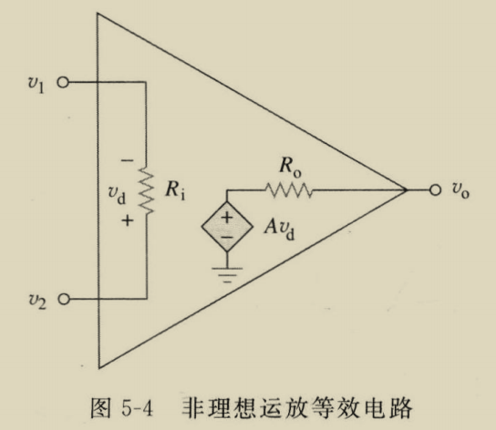

电路基础 精编版 Charles K. Alexander & Matthew N. O. Sadiku
# 一

| 基本物理量  | 数值                     | 备注  |
| ------ | ---------------------- | --- |
| 电子的电荷量 | $1.602\times10^{-19}C$ |     |
|        |                        |     |

**1.1** 基尔霍夫电流、电压定律（$\text{Kirchhoff's Current,Voltage Law}$，简称 $\text{KCL,KVL}$。

**1.2** 电阻的等效替换。

等效电阻的本质是，在起始点电位固定时，替换前后通过起始点的电流不变，求解的关键在于求解内部节点的电位。

合并串联、并联电阻后，一张电阻拓扑图可以表示为 $n$ 点 $m$ 边的图，定义好各边电流方向后和起始点 $s,t$ （不同）后，可设 $n$ 个未知量即节点电位 $\varphi_i$，记 $2m$ 个边电流为 $i_{ij}=-i_{ji}$，电阻 $r_{ij}=r_{ji}$，则 $r_{ij}i_{ij}=\varphi_{i}-\varphi_{j}$，可得以下方程
$$
\sum\limits_{j}i_{ij}=0\quad (i\neq s,t)
$$
方程数量为 $n-2$，可解出 $\varphi_{i}(i\neq s,t)$ 关于 $\varphi_{s},\varphi_{t}$ 的表达式，等效电阻为
$$
R={U_{0}\over\sum\limits_{j\neq s}i_{sj}}={U_{0}\over-\sum\limits_{j\neq  t}i_{tj}}
$$
除解方程法外，在一些情况下对图结构变换可以产生更多串联、并联电阻，从而使新图在合并后点数、边数减少，典型的变换是 $\text{Y-}\Delta$ 变换和 $\Delta\text{-Y}$ 变换。

```
       1              1
	   |              |
      R_1            / \
       |          R_12 R_31
      / \          /     \
    R_2 R_3        --R_23--
    /     \      /         \
   2       3    2           3
```
$\text{Y}$ 型电路的电阻用 $R_{1},R_{2},R_{3}$ 表示，$\Delta$ 型电路则 $R_{12},R_{23},R_{31}$，变换公式是
$$
\begin{cases}
\displaystyle R_{ij}={R_{1}R_{2}+R_{2}R_{3}+R_{3}R_{1}\over R_{k}} \\
\displaystyle R_{i}={R_{i-1,i}R_{i,i+1}\over R_{12}+R_{23}+R_{31}}
\end{cases}

$$

**1.3** 直流电路的一般分析法。

节点电压法：人位定义某节点为 0 电位点，然后设 $n-1$ 个节点电位未知量，对 $n-1$ 个节点运用 $KCL$ 建立 $n-1$ 个方程。

网孔电流法：设 $f$ 个网孔，对每个网孔设网孔电流的未知量，然后利用 $KVL$ 对 $f$ 个网孔建立 $f$ 个方程。

前者是本质且通用的，后这仅在电路图为平面图时可用。

**1.4** 戴维南定理、诺顿定理。

戴维南定理：任何仅包括理想电压源、理想电流源、线性电阻的二端电路都可等效于一个理想电压源串联上一个等效电阻。

注意线性受控源存在的情况下，戴维南定理不成立。

求解等效源的方法是：
（1）等效电压为二段的开路电压
（2）等效电阻为关闭电路中的理想电压、流源后电路的等效电阻。

诺顿定理：也可等效于一个理想电流源并联上一个等效电阻。


# 二

**2.1** 非理想运放的等效电路为

理想运放相当于 $+-$ 输入电位相同且电流为 $0$。


![[运放的典型取值范围.png]]


**2.2** 反相放大器。

$$
v_{o}=-{R_{f}\over R_{1}}v_{s}
$$

**2.3** 同相放大器。
$$
v_{o}=\left(1+{R_{f}\over R_{1}}\right)v_{s}
$$
当 $R_{f}=0$ 或 $R_{1}=\infty$ 时，$v_{s}=v_{o}$，相当于电压跟随器，据教材，它可降低前后两级的相互影响。

**2.4** 加法放大器。

$$
v_{o}=-\left(\sum\limits_{i}{R_{f}\over R_{i}}v_i\right)
$$
**2.5** 差分放大器。

$$
v_{o}=-{R_{2}\over R_{1}}v_{1}+{R_{2}\over R_{1}}{1+\frac{R_{1}}{R_{2}}\over1+\frac{R_{3}}{R_{4}}}v_{2}
$$
特定的 $R_{2}\over R_{1}$ 与 $R_{3}\over R_{4}$ 可产生不同的线性减法组合。

也可用两个级联的反相放大器做到与差分放大器类似的效果。

# 三、电容与电感

**3.1** 非理想电容：电容并联一个电阻。非理想电感：电感串联一个电阻，然后并联一个电容。

电容的并联等效于电容值求和，串联则等效于电容值的倒数求和，电感正相反。

常见电容有聚酯电容、陶瓷电容、贴片电容、电解电容、电感有螺线管电感、环形电感、色码电感。


