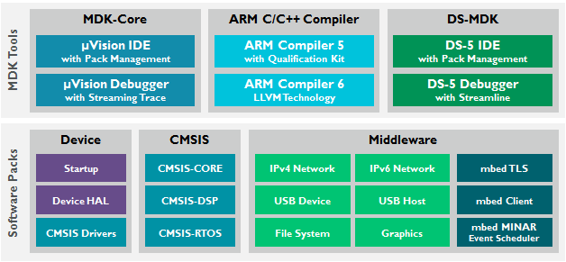

STM32

注意事项：
（1）DC005供电范围：6~24V
（2）IO口不要接大于 5V 的电压，否则会报废板子
（3）不要用 IO 口直接驱动感性负载（电机、电磁阀、继电器等）
（4）防静电

### 调试

JTAG 与 SWD

MDK5 + MDK6

### 最小系统设计

- 供电
- 复位
- 时钟
- boot 启动
- 下载电路
- 后备电池

### stm32 复位与启动流程

在上电或复位后，cortex M3 会从 `0x0000_0000` 读出 `MSP`，然后从 `0x0000_0004` 读出 `reset_handler` 的入口地址，最后执行 `reset_handler` 函数。

所以要保证 `cortex M3` 能从 `0x0000_0000` 访问向量表，然而代码可能在不同存储器上，ST 的解决方案是对 `0x0000_0000` 做地址映射，在 STM32F1/F4 里，可以通过 BOOT[1:0] 引脚选择三种不同启动模式。

| Boot1 | Boot0 | 启动模式   | 映射地址                          |
| ----- | ----- | ------ | ----------------------------- |
| X     | 0     | 主闪存存储器 | `0x0800_0000` → `0x0000_0000` |
| 0     | 1     | 系统存储器  | `0x1FFF_0000` → `0x0000_0000` |
| 1     | 1     | SRAM   | `0x2000_0000` → `0x0000_0000` |

### STM32 结构

[stm32 结构](https://zhuanlan.zhihu.com/p/362572057)
[stm32 时钟树详解](https://zhuanlan.zhihu.com/p/339529771)
stm32 上电时所有外设时钟被禁用

### 程序烧录

常见有 USB+串口、JTAG、SWD

usb 串口烧录流程
- **硬件连接** 将开发板上 uart 的 RX 与 TX 分别与 mcu 的指定串口的 TX 与  RX 分别连接起来，在正点原子的板子上是将 RXD 与 PA9 以及 TXD 与 PA10 连接起来。
- **软件配置** 使用软件串口烧录软件，如 FlyMcu，选择相应的 Port 与 bps（波特率），stmf1 系列支持的最高波特率是 460800，stmf4 是 76800。
- **标准方法(可选)**
	- 把 B0 接 V3.3（保持 B1 接 GND），按下复位键
	- 点击烧录
	- 将 B0 接回 GND，按下复位键
- **一键烧录** 标准方法需要麻烦地动两次跳线帽，flymcu 利用串口的 DTR 和 RTS 信号，分别控制 STM32 的复位和 B0，实现一键下载，但需要在 flymcu 中选择选项 DTR 的低电平复位，RTS 高电平进 BootLoader 。
flymcu 下载是全片擦除的，较 ST link 慢。

JTAG/SWD 烧录流程（包括 ST-Link、J-Link、U-Link、DAP-Link）
- 将调试器接入板子。
- 打开 Keil 工程，进入 `Options for Target` → `Debug` 选项卡，选择调试器。
- 点击 Settings，在 Port 选项选择 JTAG 或者 SW，选择时钟（默认 4MHz）
- MDK 上点击 Download(F8) 按钮烧录。

JTAG 支持更复杂的调试功能，适用复杂芯片的调试（FPGA、多核），速度较慢。
SWD 适合 STM32 等 ARM Cortex-M 常规调试，速度更快。

### stm32 工程搭建

##### 方案一、基于 MDK 的手动创建工程

- 选择芯片型号，这里是 stm32f103zet6
- 根据型号选取 ARM 公司提供的基本文件，最小工程包含如下文件，除了 `main.c` 都可以在 ST 公司提供的固件库中找到。
```
main.c
startup_stm32f103_hd.s
stm32f10x.h
system_stm32f1xx.h
system_stm32f1xx.c
core_cm3.h
core_cm3.c
```
其中 `main.c` 内容如下
```c
#include "stm32f10x.h"  // 包含设备寄存器定义

int main(void) {
	// SystemInit();
	int i = 0;

	while (1) {
		i++;
	}
}
```

- 程序烧录与 Debug

ST 公司提供的 startup 文件的核心功能包括：初始化堆栈、设置向量表、初始化.data/.bss段、跳转到main。

##### 方案二、STM32CubeMX 生成基础工程

待补充

### ALIENTEK 开发板实验分类
- **基础**：GPIO、AFIO、中断、按钮输入
- **时钟**：TIM 定时器、RTC实时时钟、待机唤醒、IWDG&WWDG看门狗
- **通信**：串口通信、IIC、SPI、CAN、USB、无线通信、网络通信
- **数模**：ADC、DAC、PWM
- **传感**：内部温度、光敏、温度、湿度、红外遥感、MPU6050 六轴传感器
- **存储**：DMA、EEPROM+IAP、外 SRAM、SD卡、内存管理、文件系统
- **交互**：OLED显示屏、TFTLCD显示屏、触摸屏、摄像头、音频、图片、文字、Joyboard
- **RTOS**：UCOS
### 仿真


### 常见词汇解释

**MDK(Microcontroller Development Kit)**：ARM 公司为 arm 系列芯片提供的嵌入式开发工具，结构包括。


**CH340**：一种 usb 转串口的驱动

**DTR(Data Terminal Ready)**：来自USB转串口工具（如CH340、CP2102、FT232等）的硬件流控制信号。

**ISP(In-System Programming)**：烧录程序

**GPIO（General Purpose Input/Output）**：通用输入输出，是STM32等嵌入式系统中，与外部设备进行数字信号交互的端口。

