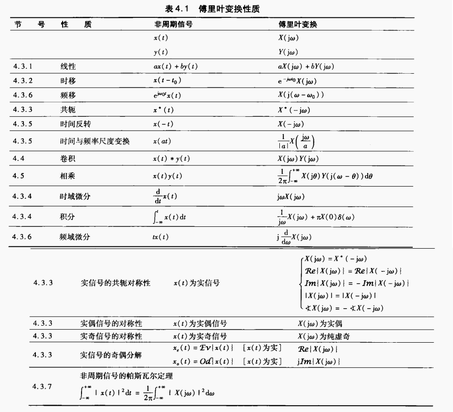
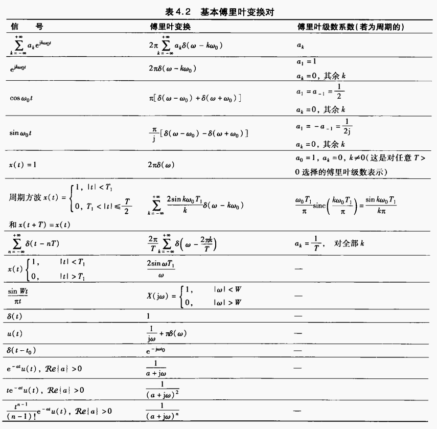
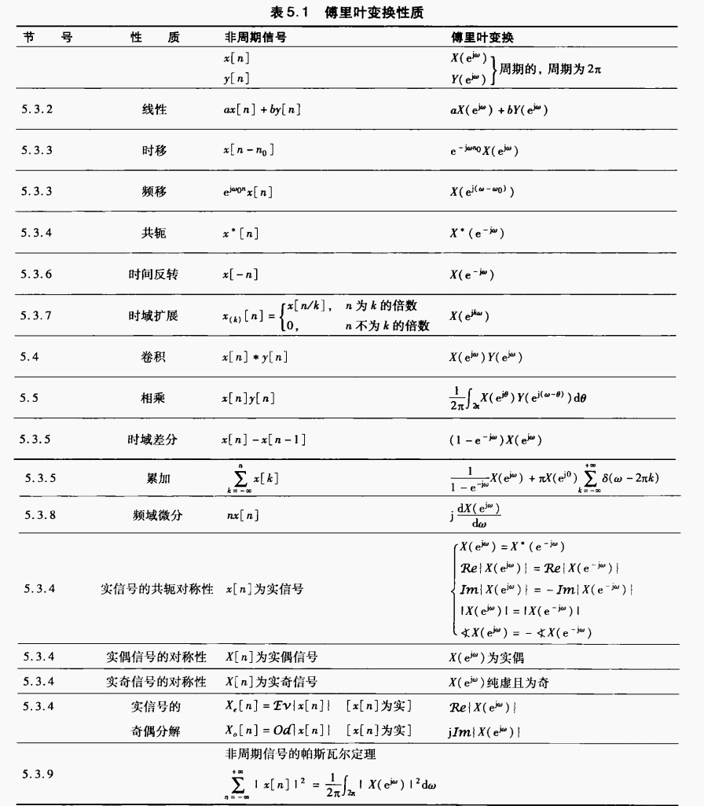
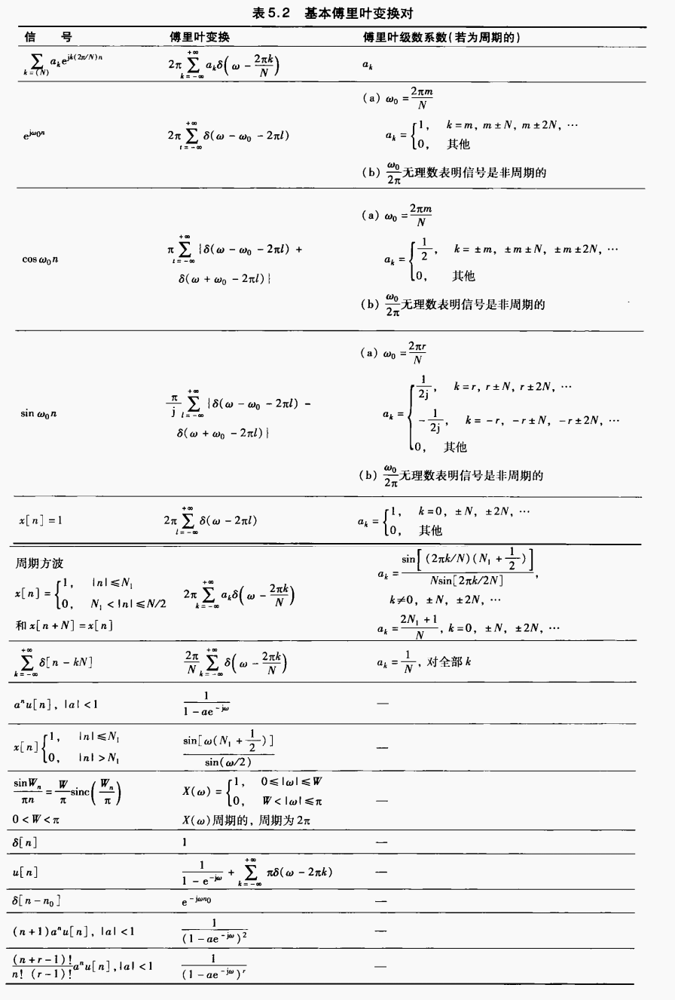

# 傅里叶级数

LTI 系统对信号的响应可以用卷积描述，对离散和连续型号，响应的定义如下
$$
\begin{gather}
y_{n}=\sum\limits_{k=-\infty}^{\infty}h_{k}x_{n-k}\\
y(t)=\int_{-\infty}^{+\infty}h(\tau)x(t-\tau)d\tau
\end{gather}
$$
其中 $h_{k}$ 和 $h(t)$ 是这个系统的单位冲击响应。

**1.1** 特征函数、特征值的定义

LTI 对 $z^{n}$ 和 $e^{st}$ 的影响仅仅是乘一个与 $n$ 和 $t$ 无关的因子，后者称为前者的特征函数，该因子称为特征值

$$
\begin{gather}
z^{n}\rightarrow H(z)z^{n}\quad H(z)=\sum\limits_{k=-\infty}^{+\infty}h_{k}z_{-k}\\
e^{st}\stackrel{}{\rightarrow}H(s)e^{st}\quad H(s)=\int_{-\infty}^{+\infty}h(t)e^{-st}dt\\
\end{gather}
$$

$z^{n}$ 与 $e^{st}$ 正好是傅里叶级数的基函数。

**1.2** 傅里叶级数。

如果一个信号能表示成傅里叶级数，其 LTI 系统的特征值 $H(z),H(s)$ 已知，那么该系统对信号的影响就能通过傅里叶级数来表示。

周期函数的傅里叶级数如下
$$
\begin{gather}
x_{n}=\sum\limits_{k=0}^{N-1}a_{k}(e^{jk\omega_{0}})^{n}\\
x(t)=\sum\limits_{k=-\infty}^{+\infty}a_{k}e^{jk\omega_{0}t}
\end{gather}
$$

周期函数的傅里叶系数计算公式如下
$$
\begin{gather}
a_{k}={1\over N}\sum\limits_{n=0}^{N-1}x_{n}(e^{-jk\omega_{0}})^{n}\\
a_{k}={1\over T}\int_{0}^{T}x(t)e^{-jk\omega_{0}t}dt
\end{gather}
$$
可以看到，离散信号的有效傅里叶级数只有 $N$ 项，连续信号的则有无穷项。

周期函数到傅里叶系数的变换记作
$$
x_{n}\stackrel{\mathcal{FS}}{\longleftrightarrow}a_{k}\quad x(t)\stackrel{\mathcal{FS}}{\longleftrightarrow}a_{k}
$$

**1.3** 傅里叶级数系数的运算。
![[周期信号傅里叶级数性质-离散.png]]
![[周期信号傅里叶级数性质-连续.png]]

**1.4** 频率响应

研究清楚 LTI 系统对 $z=e^{j\omega}$ 或 $s=j\omega$ 的频率响应，即 $H(e^{j\omega})$ 与 $H(j\omega)$（分别对应离散和联系），就能用傅里叶级数系统对信号的影响。

# 傅里叶变换

**2.1** 非周期函数的傅里叶变换。
$$
\begin{gather}
X(j\omega)=\int_{-\infty}^{+\infty}x(t)e^{-j\omega t}dt\\
x(t)={1\over 2\pi}\int_{-\infty}^{+\infty}X(j\omega)e^{j\omega t}d\omega
\end{gather}
$$
收敛的充分条件是
（1）能量有限 $\displaystyle \int_{-\infty}^{+\infty}|x(t)|^{2}dt<\infty$

**2.2** 周期函数的傅里叶变换。

周期函数的能量是无限的，直接用公式求频域 $X(j\omega)$ 是不现实的，但可以先将 $x(t)$ 表示成傅里叶级数，然后再用奇异函数 $\delta(t)$ 表示 $X(j\omega)$，有两种情况

情况一：$x(t)$ 是正常函数
$$
x(t)=\sum\limits_{k=-\infty}^{+\infty}c_{k}e^{j\omega_{0}t}\stackrel{\mathcal{FT}}{\longrightarrow}\sum\limits_{k=-\infty}^{+\infty}2\pi c_{k}\delta(\omega-k\omega_{0})
$$
情况二：$x(t)$ 是周期奇异函数，以 $\displaystyle x(t)=\sum\limits_{=-\infty}^{+\infty}\delta(t-kT)$ 为例，其傅里叶级数为
$$
\sum\limits_{k=-\infty}^{+\infty}{1\over T}e^{-j{2k\pi\over T}t}
$$
于是
$$
x(t)\stackrel{\mathcal{FT}}{\longrightarrow}{2\pi\over T}\sum\limits_{k=-\infty}^{+\infty}\delta(\omega-{2k\pi\over T})
$$
**2.3** 傅里叶变换的性质

对偶性
$$
x(t)\stackrel{\mathcal{FT}}{\longrightarrow}X(j\omega)\Rightarrow X(-jt)\stackrel{\mathcal{FT}}{\longrightarrow}2\pi x(\omega)
$$

卷积保奇偶：奇函数与偶函数的卷积是奇函数，其它类似

周期叠加信号的傅里叶变换，设 $x(t)$ 能量有限，$t>0$ 则
$$
\sum\limits_{k=-\infty}^{+\infty}x(t-kT)\stackrel{\mathcal{FS}}{\longrightarrow}{1\over T}X(j{2\pi k\over T})
$$

**2.4** 常见傅里叶变换

# 离散傅里叶变换

**3.1**  非周期离散函数的傅里叶变换。$X(e^{j\omega})$ 一定是以 $2\pi$ 为周期的
$$
\begin{gather}
X(e^{j\omega})=\sum\limits_{n=-\infty}^{+\infty}x_{n}e^{-j\omega n}\\
x_{n}={1\over 2\pi}\int_{2\pi}X(j\omega)e^{j\omega n}d\omega
\end{gather}
$$
收敛的充分条件是
（1）能量有限 $\displaystyle \int_{-\infty}^{+\infty}|x(t)|^{2}dt<\infty$

**3.2** 周期离散函数的傅里叶变换。设 $x_{n}$ 的周期为 $N$，傅里叶级数为

$$
a_{k}={1\over N}\sum\limits_{n\in <N>}x_{n}e^{-jkn}
$$
则其傅里叶变换为
$$
X(e^{j\omega})=\sum\limits_{k=-\infty}^{+\infty}2\pi a_{k}\delta(\omega-{2\pi k\over N})
$$
**3.3** 离散傅里叶变换的性质

对偶性（与周期为2的傅里叶级数成对偶关系）
$$
\begin{gather}
x[n]\stackrel{\mathcal{FT}}{\longrightarrow}X(e^{j\omega})\\
X(e^{-j\omega})\stackrel{\mathcal{FS}}{\longrightarrow}x[n]
\end{gather}
$$

**3.4** 常见离散傅里叶变换

