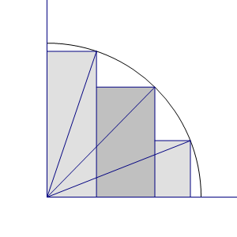

**T20220717-1**

设 $\displaystyle 0<x<y<z<{\pi\over2}$，求证
$$
{\pi\over2}+2\sin x\cos y+2\sin y\cos z>\sin 2x+\sin 2y+\sin 2z
$$
**证**

原不等式等价于
$$
\sin x(\cos x-\cos y)+\sin y(\cos y-\cos z)+\sin z\cos z<{\pi\over 4}
$$

注意不等式左端等价于上图阴影矩形面积之和，不等式右端等价于四分之一单位圆面积之和，于是不等式显然成立。

