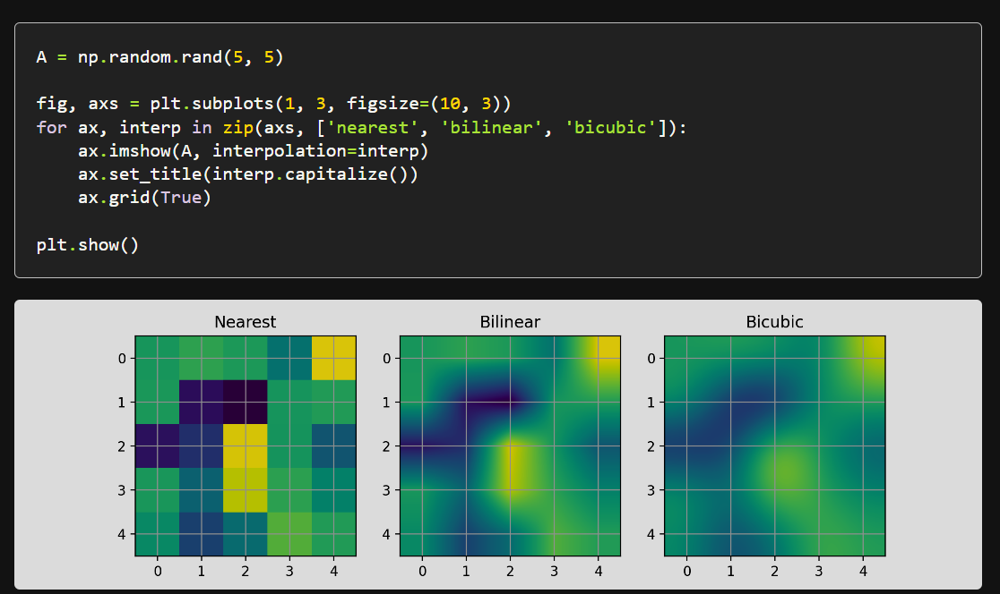

神经网络与深度学习的流程

1. 数据的收集与预处理
2. 模型的选择与搭建
3. 模型的训练与调参
   1. Debug 时检查：
      1. 网络层搭建是否正确、train_loss与test_loss计算是否正确、训练or评估时是否开启训练or评估模式
      2. 先使训练步进少一点，快速训练完验证模型的保存是否无Bug
   2. 防呆测试
   3. 参数可视化
   4. 早停
   5. 网络搜索调参、随机搜索调参（缝合一个模拟退火）
4. 高性能优化
### PyTroch
#### 环境搭建
python3.12

```
pip install numpy
pip install matplotlib
pip install torch
pip install torchvision

### 桌面游戏窗口读取
pip install pywin32
pip install opencv-python
pip install pyautogui
pip install keyboard
```
在 python 中验证库是否成功安装
```python
import numpy
import matplotlib
import torch
import torchvision
import win32gui
import cv2
import pyautogui
import keyboard
```
#### torch.utils.data

[一文弄懂Pytorch的DataLoader, DataSet, Sampler之间的关系](https://zhuanlan.zhihu.com/p/76893455) 
#### torchvision.transforms
#### tensoboardX 可视化神经网络

### 数据的收集与预处理

#### 数据的可视化

```python
A = np.random.rand(5, 5)

fig, axs = plt.subplots(1, 3, figsize=(10, 3))
for ax, interp in zip(axs, ['nearest', 'bilinear', 'bicubic']):
    ax.imshow(A, interpolation=interp)
    ax.set_title(interp.capitalize())
    ax.grid(True)

plt.show()
```



```python
import matplotlib.pyplot as plt
import matplotlib.cbook as cbook
import matplotlib.patches as patches

with cbook.get_sample_data('grace_hopper.jpg') as image_file:
    image = plt.imread(image_file)

fig, ax = plt.subplots()
im = ax.imshow(image)
patch = patches.Circle((260, 200), radius=200, transform=ax.transData)
im.set_clip_path(patch)

ax.axis('off')
plt.show()
```
### 模型的选择与搭建
#### 预训练模型的下载
[官网模型网址](https://pytorch.org/hub/research-models)
要查看PyTorch官网提供的所有预训练模型，可以按照以下步骤进行：
1. 访问PyTorch官网，并导航到“Resource”部分。
2. 在“Resource”下，找到并点击“Models (Beta)”链接。这将带你到PyTorch官方发布的预训练模型页面。
此外，可以运行以下代码来查看`torchvision.models`中提供的所有预训练模型：
```python
import torchvision.models as models
print(dir(models))
```
#### 预训练模型的导入
```python
nnw = MobileNetV2(num_classes=10)
model_weight_path = "./mobilenet_v2-b0353104.pth"
assert os.path.exists(model_weight_path), "file {} dose not exist.".format(model_weight_path)
pre_weights = th.load(model_weight_path, map_location='cpu')
pre_dict = {k: v for k, v in pre_weights.items() if nnw.state_dict()[k].numel() == v.numel()}
missing_keys, unexpected_keys = nnw.load_state_dict(pre_dict, strict=False)

## Freeze the features weight
for param in nnw.features.parameters():
	param.requires_grad = False
## Check the loaded parameters and missing parameters
i = 0
for i in range(min(6, len(missing_keys))):
	print(missing_keys[i])
for i in range(min(6, len(unexpected_keys))):
	print(unexpected_keys[i])
```
### 模型的训练与调参

#### 模型的保存与加载
```python
epoches, learn_rate, momentum = 20, 0.01, 0.5
nnw = MyNet()
opt = torch.optim.SGD(nnw.parameters(), lr = learn_rate, momentum=momentum)
model_path = './MyNet.pth'
model_parameters_path = './MyNet.parameters.pth'
ck_path = './MyNet.ckpt'
##保存模型
#整个模型
torch.save(nnw, model_path)
#参数
torch.save(nnw.state_dict(), model_parameters_path)
#checkpoints
torch.save({
    'epoches':epoches,
    'learn_rate':learn_rate,
    'opt':opt,
    'model':nnw,
}, ck_path)
##载入模型
#整个模型
nnw = torch.load(model_path)
#参数
pre_weights = torch.load(model_parameters_path)
pre_dict = {k: v for k, v in pre_weights.items() if nnw.state_dict()[k].numel() == v.numel()}
missing_keys, unexpected_keys = nnw.load_state_dict(pre_dict, strict=False)
#或者直接一句 nnw.load_state_dict(torch.load(model_parameters_path))
#checkpoints
ck_dict = torch.load(ck_path)
epoches, learn_rate, momentum = ck_dict['epoches'], ck_dict['learn_rate'], ck_dict['momentum']
nnw, opt = ck_dict['model'], ck_dict['opt']
```

通过子模块的直接访问可以轻松复制相同网络结构的参数

```python
# 假设两个模型都有一个名为 'feature_extractor' 的子模块
dq_net.feature_extractor.load_state_dict(
    conv_net.feature_extractor.state_dict()
)
```
#### 数据集和训练器的构建


#### 超参数调优

- **网格搜索**：系统地探索超参数空间。
- **贝叶斯优化**：更高效的搜索策略。

#### 模型集成
