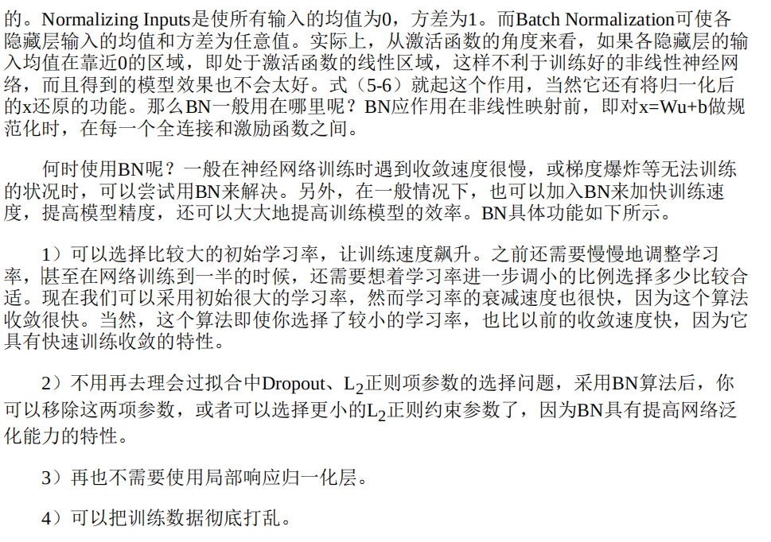
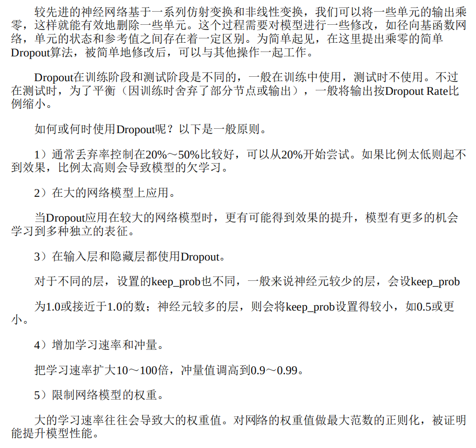

### 神经网络任务

### 监督学习

简单的说监督学习就是在已知一定数量的训练集(就是输入输出对)的基础上通过建立一个概率系统P()，实现对新的输入能够进行有效的预测:，并把错误率保持在可以接受的范围内。
根据输入变量和输出变量类型的不同，又可以把监督学习问题详细的分成以下三类：
1.输入变量和输出变量均为连续变量（标量或向量）的预测问题称为回归问题
2.输出变量为有限个离散变量的预测问题称为分类问题
3.输入变量与输出变量均为变量序列的预测问题称为标注问题（如机器翻译、语言转文字）

分类问题
二元分类、多分类（小数目分类（多层逻辑回归 softmax，Weston-Watkins支持向量机）大数目分类（分层 softmax）)
单标签、多标签识别问题
### 无监督学习

监督学习的输入数据中有标签或目标值，但在实际生活中，有很多数据是没有标签的，或者标签代价很高。这些没有标签的数据也可能包含很重要的规则或信息，从这类数据中学习到一个规则或规律的过程被称为无监督学习。在无监督学习中，我们通过推断输入数据中的结构来建模，模型包括

1. 关联分析：关联分析是一种在大规模数据集中寻找有趣关系的任务。
2. 聚类
3. 降维

#### 半监督学习

半监督学习是监督学习与无监督学习相结合的一种学习方法。半监督学习使用大量的未标记数据，同时由部分使用标记数据进行模式识别。

自编码器是一种半监督学习，其生成的目标就是未经修改的输入。

1. 语言处理中根据给定文本中的词预测下一个词，也是半监督学习的例子。

2. 对抗生成式网络也是一种半监督学习，给定一些真图片或语音，然后通过对抗生成网络生成一些与真图片或是语音逼真的图形或语音

#### 强化学习

强化学习主要包含4个元素：智能体（Agent）、环境状态、行动和奖励。强化学习的目标就是获得最多的累计奖励。

强化学习把学习看作一个试探评价的过程，Agent选择一个动作用于环境，环境接受该动作后状态发生变化，同时产生一个强化信号（奖或惩）反馈给Agent，Agent根据强化信号和环境当前状态再选择下一个动作，选择的原则是使受到正强化（奖）的概率增大。

选择的动作不仅影响立即强化值，也影响下一时刻的状态和最终的强化值。

强化学习不同于监督学习，主要表现在教师信号上。强化学习中由环境提供的强化信号是Agent对所产生动作的好坏做的一种评价，而不是告诉Agent如何去产生正确的动作。

由于外部环境只提供了很少的信息，所以Agent必须靠自身的经历进行学习。通过这种方式，Agent在行动一一被评价的环境中获得知识，改进行动方案以适应环境。

AlphaGo Zero带有强化学习内容，它完全摒弃了人类知识，碾压了早期版本的AlphaGo。

### 激活函数（非线性函数）、损失函数

#### 激活函数

##### tanh

$$
\tanh(x)={e^x-e^{-x}\over e^x+e^{-x}}=1-{2\over e^{2x}+1},\\ \tanh'(x)={4\over 1+e^{2x}}(1-{1\over 1+e^{2x}})
$$

**PReLU**
$$
\mathrm{PReLU}(x)=\left\{\begin{aligned}&x&x\ge0\\&px&(x\le 0)\end{aligned}\right.\\
\mathrm{PReLU}_x(x)=\left\{\begin{aligned}&1&x\ge0\\&p&(x\le 0)\end{aligned}\right.\\
\mathrm{PReLU}_p(x)=\left\{\begin{aligned}&0&x\ge0\\&x&(x\le 0)\end{aligned}\right.\\
$$
##### Mish
$$
\begin{gather}
\mathrm{Mish}(x)=x\cdot \tanh(\mathrm{softplus}(x))=x\cdot\tanh(\ln(1+e^{x}))\\
\end{gather}
$$

#### 最终层

常用损失函数是差值平方和差值绝对值，前者导数连续。

##### softmax

$$
\hat{y}={\exp(x^{(L)})\over\displaystyle \sum_{i=1}^{n_L}\exp(x^{(L)}_i)}
$$

用于多选一分类。
$$
\begin{aligned}
{\partial  L\over \partial  x^{L}_i}&={1\over\displaystyle\left(\sum_{k=1}^{n_L}\exp(x^{(L)}_k)\right)^2}\sum_{j=1}^{n_L}\left(-\exp(x^{(L)}_j+x^{(L)}_i)+[i=j]\exp(x^{(L)}_i+\sum_{k=1}^{n_L}x^{(L)}_k)\right){\partial L\over\partial \hat{y}_j}\\
&=\sum_{j=1}^{n_L}{\partial L\over\partial \hat{y}_j}\cdot\left\{\begin{aligned}&\hat{y}_i(1-\hat{y}_i)&(i=j)\\&-\hat{y}_i\hat{y}_j&(i\neq j)\end{aligned}\right.
\end{aligned}
$$
一个针对数值爆炸的方法是让 $exp()$ 内的 $x^{(L)}_k$ 减去 $\max_k{x^{(L)}_k}$，这个变种不是很常用。

#### 损失函数

##### CrossEntropyLoss 交叉熵损失函数

$$
L(\hat{y})=-\sum_{i=1}^{n_L}y_i\ln\hat{y}_i
$$

需要满足 $\displaystyle\sum_{i=1}^{n_L}y_i=1,\ \sum_{i=1}^{n_L}\hat{y}_i=1$
$$
{\partial L\over \hat{y}_i}=-{y_i\over \hat{y}_i}
$$

### 

### 下降方法、学习方法

#### 梯度下降

##### 随机梯度下降

枚举每个 sample，进行逐点小步长更新。

优点：

泛化能力强，训练速度快。

在反向传播时就能边传播边更新参数，无需额外内存保存每个参数的梯度。

缺点：

训练结果与训练时喂入 sample 的顺序相关，在某些排序下偶尔会表现出糟糕结果（解决办法：训练前对 sample 们进行一次随机排序。

抗噪能力弱，错误 sample 或冷门 sample 对整个模型的影响性大。

##### 小批量随机梯度下降

将 sample 分批，然后分批训练，枚举到某批 sample 时，用各 sample 所计算出的梯度值的平均值作为该批训练所计算出的梯度值。

小批量的尺寸一般为 $2$ 的幂次，这样选择在多数硬件架构上通常能获得最高的效率，常见尺寸有 $32,64,128,256$。

优点：

泛化能力强，训练速度快。

缺点：

需要额外内存保存每个参数的梯度，同一批次内对所有 sample 反向传播后才能更新每个参数。

抗噪能力比随机梯度下降强。

小批量随机梯度下降比随机梯度下降更常见。

#### 参数特异的学习率

$\beta\in(0,1)$ 称作动量参数或摩擦参数。
$$
V\leftarrow \beta V-\alpha {\partial L\over \partial W};W\leftarrow W+V
$$

##### $\text{Nesterov}$ 动量

$$
V\leftarrow \beta V-\alpha {\partial L\over \partial W};W\leftarrow W+V
$$

该方法在适宜批量大小的小批量梯度下降方法中起作用。

##### $\text{RMSProp}$

衰减因子 $\rho\in(0,1)$，$A$ 初始化为 $1$，$\varepsilon$ 是一个较小的正因子（如 $10^{-8}$）。
$$
A\leftarrow\rho A+(1-\rho)\left({\partial L\over\partial W}\right)^2\\
W\leftarrow W-{\alpha\over\sqrt{A+\varepsilon}}{\partial L\over\partial W}
$$
##### $\text{AdaDelta}$

$$
\delta\leftarrow\rho \delta+(1-\rho)(\Delta W)^2\\
A\leftarrow\rho A+(1-\rho)\left({\partial L\over\partial W}\right)^2\\
W\leftarrow W-{\delta\over\sqrt{A+\varepsilon}}{\partial L\over\partial W}
$$

##### $\text{Adam}$ 

衰减因子 $\rho,\rho_f\in(0,1)$，$A$ 与 $V$ 初始化为 $0$，$\varepsilon$ 是一个较小的正因子（如 $10^{-8}$）。
$$
t\leftarrow t+1\\
A\leftarrow\left(\rho A+(1-\rho)\left({\partial L\over\partial W}\right)^2\right)\\
V\leftarrow\left(\rho_f V-(1-\rho_f){\partial L\over\partial W}\right)\\
W\leftarrow W-\alpha {V/(1-\rho_f^t)\over \sqrt{A/(1-\rho^t)+\varepsilon}}
$$
论文里推荐的参数组合是 $\rho =0.999,\ ,\rho_f=0.9$。

### 参数设置、预处理、检测

#### 检查梯度计算的正确性

$$
{\partial L(w)\over \partial w} \approx {L(w+\varepsilon)-L(w)\over\varepsilon}
$$

设 $G_e$ 表示反向传播得到的导数，估算值用 $G_a$ 表示，那么相对误差比值可为
$$
\rho=\left|{G_e-G_a\over G_e+G_a}\right|
$$
一般来说，取 $\varepsilon=10^{-3}|w|$，$\rho$ 应该小于 $10^{-6}$，当激活函数为 $\text{ReL}$ 这样的突变函数时，$\rho$ 也应该小于 $10^{-3}$。

当参数总数很大时，可以随机选取部分参数进行检测。

#### 超参数设置

多分辨率采样。

对超参数的对数值而非超参数本身均匀采样，如学习率与正则率。

#### 特征预处理

##### 平均中心化

对 sample 的特征（属性、神经网络输入值）进行平均中心化和标准化，即减去平均值后除于标准差

##### 归一化

最小-最大归一化

#### 参数初始化

偏置一般初始化为 $0$。

一种初始化权值的合理方式是从均值为 $0$，标准差很小的高斯分布中生成初始值。

设激活函数在 $0$ 处的导数为 $a$（$\text{ReLU}$ 在 $0$ 处的导数不存在，但可以用 $1$ 代替）。

#### 均值为零的高斯分布

$\text{Xavier}$ 方法：

根据论文中的公式推倒，需要满足激活函数为奇函数的条件。

方式一：对每个神经元，设它有 $r$ 个输入数量，则这些输入边的权值用标准差为 $\sqrt{1\over ra^2}$ 均值为 $0$ 的高斯分布初始化。优点：若输入向量中每个元素的方差相等，为 $var_0$，则前向传播时每个中间结点的激活值的方差均为 $var_0$。

类似的，若改神经元有 $c$ 个输出数量，也可使用标准差为 $\sqrt{1\over ca^2}$ 均值为 $0$ 的高斯分布初始化。优点：若最终层每个元素的结果值对损失函数的导数的方差为 $var_0$，则反向传播时每个中间结点的激活值对损失函数的导数的方差均为 $var_0$。

方式二：对于某个权值矩阵，设它行数为 $r$ 列数为 $c$，则权值用标准差为 $\sqrt{2\over (r+c)a^2}$ 均值为 $0$ 的高斯分布初始化。优点：若输入向量中每个元素与输出向量中每个元素的方差相等，则前向传播和反向传播都能让中间结点方差大致相等。

其中参数 $a$ 是激活函数在 $0$ 处的导数，若想要使方差在传播时逐层放缩，将标准差多成一个放缩因子，如 $ \sqrt{2\beta^2\over(r+c)a^2}$。

千层饼的训练就用了 $\text{Xavier}$ 方法。

[深度学习参数初始化（一）Xavier初始化 含代码](https://blog.csdn.net/xian0710830114/article/details/125540678)

关于方差的参考公式：
$$
\begin{gather}
D(X+Y)=D(X)+D(Y),\ D(kX)=k^2D(X)\\
D(XY)=D(X)D(Y)+E^2(Y)D(X)+E^2(X)D(Y)\\
\end{gather}
$$

#### 均匀分布

略

### 梯度消失和梯度爆炸问题

$\text{sigmod}$ 的导数不超过 $0.25$，当网络层数深一点时容易发生梯度消失。

$\text{tanh}$ 在 $0$ 处的导数为 $1$，但当激活前值偏离 $0$ 时导数会快速驱于 $0$

$\text{hard-tanh}$ 与 $\text{ReLU}$ 均在某段区间内恒为 $1$，当大多数单元工作于梯度为 $1$ 的区间内，梯度消失问题会较少，反过来当大多数神经元离开这个区间时，就几乎不会更新，且输出固定，成为死亡神经元。

##### 解决方法一：换激活函数

带泄露的 $\text{ReLU}$

$\text{maxout}$

**解决方法二：换结构**

批归一化

#### 批归一化

已知向量 $v^{(r)},\ \gamma,\ \beta$，一层中的前向传播
$$
\mu={1\over m}\sum_{r=1}^mv^{(r)},\ \sigma^2= {1\over m}\sum_{r=1}^m(v^{(r)}-\mu)^2+\varepsilon, \ a^{(r)}=\gamma{v^{(r)}-\mu\over\sigma}+\beta\\
$$
已知向量 $\displaystyle {\partial L\over\partial a^{(r)}}$，一层中的反向传播
$$
\begin{gather}
{\partial L\over\partial \gamma}={1\over\sigma}\sum_{r=1}^m{\partial L\over\partial a^{(r)}}{(v^{(r)}-\mu)},\ {\partial L\over\partial \beta}=\sum_{r=1}^m{\partial L\over\partial a^{(r)}}\\
{\partial L\over\partial (\sigma^2)}=-{\gamma\over2\sigma^3}\sum_{r=1}^m{\partial L\over\partial a^{(r)}}(v^{(r)}-\mu)=-{\gamma\over2 \sigma^2}{\partial L\over\partial\gamma}\\
{\partial L\over\partial\mu}=-{\gamma\over\sigma}\sum_{r=1}^m{\partial L\over\partial a^{(r)}}-{1\over2m}{\partial L\over\partial(\sigma^2)}\sum_{r=1}^m(v^{(r)}-\mu)=-{\gamma\over\sigma}{\partial L\over\partial\beta}\\
\begin{aligned}
{\partial L\over\partial v^{(r)}}&={\gamma\over\sigma}\sum_{r=1}^m{\partial L\over\partial a^{(r)}}+{1\over m}{\partial L\over\partial\mu}+{2(v^{(r)}-\mu)\over m}{\partial L\over\partial(\sigma^2)}\\
&=({1\over m}-1){\partial L\over\partial\mu}+{2(v^{(r)}-\mu)\over m}{\partial L\over\partial(\sigma^2)}\\
&={\gamma\over\sigma}(1-{1\over m}){\partial L\over\partial\beta}-{\gamma(v^{(r)}-\mu)\over m \sigma^2}{\partial L\over\partial\gamma}
\end{aligned}
\end{gather}
$$
简洁的表示就是
$$
\begin{gather}
{\partial L\over\partial \gamma}={1\over\sigma}\sum_{r=1}^m{\partial L\over\partial a^{(r)}}{(v^{(r)}-\mu)},\ {\partial L\over\partial \beta}=\sum_{r=1}^m{\partial L\over\partial a^{(r)}}\\
{\partial L\over\partial v^{(r)}}={\gamma\over\sigma}(1-{1\over m}){\partial L\over\partial\beta}-{\gamma(v^{(r)}-\mu)\over m \sigma^2}{\partial L\over\partial\gamma}
\end{gather}
$$

### 过拟合解决方案

#### 正则化

通常，回归类问题中若出现了过拟合，可试试在参数学习中加入正则化
$$
{\partial L\over \partial W}\leftarrow {\partial L\over \partial W}-kW
$$
参数的正则化可与其它学习方法进行组合，如与 Nesterov 动量法的结合
$$
V\leftarrow \beta V-\alpha \left({\partial L\over \partial W}+kW\right);W\leftarrow W+V
$$
**Dropout**

### 卷积神经网络、CV 方向

**GoogleNet Inceptionv1、inceptionv2**

特点

1. 使用 Inception module 对稀疏网络进行近似
2. 在使用大卷积核前，使用 1×1 的卷积对数据进行降维以提升计算性能
3. 用 1×n 卷积核叠加 n×1 卷积核的模块代替 n×n 的卷积核以提升计算性能

#### ResduialNet

#### MobileNet

### 循环神经网络、NLP方向

#### Embedding

#### RNN

#### LSTM

#### GRU

### 生成式深度学习

#### VAE

VAE和GAN都是生成模型（Generative Model）。所谓生成模型

VAE是利用已有图像在编码器生成潜在向量，这个向量在服从高斯分布的情况下很好地保留了原图像的特征，在解码器得到的图片会更加的合理与准确。

VAE适合于学习具有良好结构的潜在空间，潜在空间有比较好的连续性，其中存在一些有特定意义的方向。VAE能够捕捉到图像的结构变化（倾斜角度、圈的位置、形状变化、表情变化等）。

但是图像在训练的时候损失函数只能用均方误差（MSE）之类的粗略误差衡量，这就导致生成的图像不能很好地保留原图像的清晰度，就会使得图片看上去有点模糊。

#### GAN

GAN生成的潜在空间可能没有良好结构，但GAN生成的图像一般比VAE的更清晰。

在GAN的训练过程中容易发生崩溃崩塌，以及训练时梯度消失情况的发生。

模型崩塌(Mode Collapse)是指模型生成的样本单一，多样性很差的现象。由于判别器只能鉴别单个样本是否为真实样本分布，并没有对多样性进行显式约束，导致生成模型可能倾向于生成真实分布的部分区间中的少量高质量样本，以此来在判别器中获得较高的概率值，而不会学习到全部的真实分布。

生成对抗网络的博弈理论只是单纯的让G生成的图像骗过D，这个会让G钻空子一旦骗过了D不论图像的合不合理就作为输出，于是模型坍塌（Generative Model）就发生了。

GAN生成器的损失函数（Loss）依赖于判别器Loss后向传递，而不是直接来自距离，因而若判别器总是能准确地判别出真假，则向后传递的信息就非常少，导致生成器无法形成自己的Loss，这是GAN比较难训练的原因。当然，针对这一不足，近些年人们采用一个新的距离定义（Wasserstein Distance）应用于判别器，而不是原型中简单粗暴的对真伪样本的分辨正确的概率。

训练GAN是生成器和判别器互相竞争的动态过程，比一般的神经网络挑战更大。为了克服训练GAN模型的一些问题，人们从实践中总结一些常用方法，这些方法在一些情况下，效果不错。当然，这些方法不一定适合所有情况，方法如下。

1）批量加载和批规范化，有利于提升训练过程中博弈的稳定性。

2）使用tanh激活函数作为生成器最后一层，将图像数据规范在-1和1之间，一般不用sigmoid。

3）选用Leaky ReLU作为生成器和判别器的激活函数，有利于改善梯度的稀疏性，稀疏的梯度会妨碍GAN的训练。

4）使用卷积层时，考虑卷积核的大小能被步幅整除，否则，可能导致生成的图像中存在棋盘状伪影。

#### CGAN、DCGAN

#### WGAN

WGAN与原始GAN第一种形式相比，只改了四点：

- 判别器最后一层去掉sigmoid
- 生成器和判别器的loss不取log
- 每次更新判别器的参数之后把它们的绝对值截断到不超过一个固定常数c
- 不要用基于动量的优化算法（包括momentum和Adam），推荐RMSProp，SGD也行

前三点都是从理论分析中得到的，已经介绍完毕；第四点却是作者从实验中发现的，属于trick。

